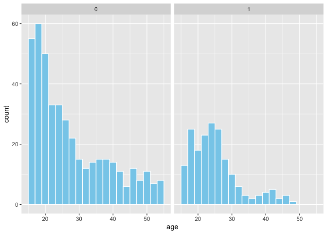
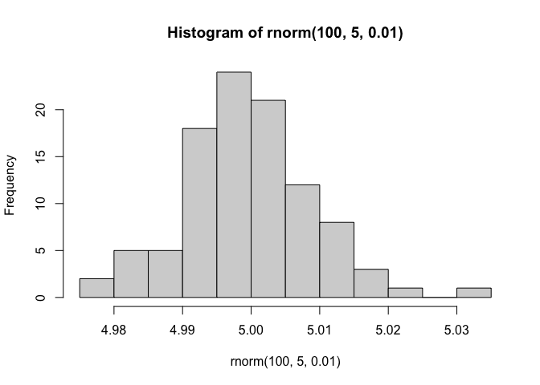
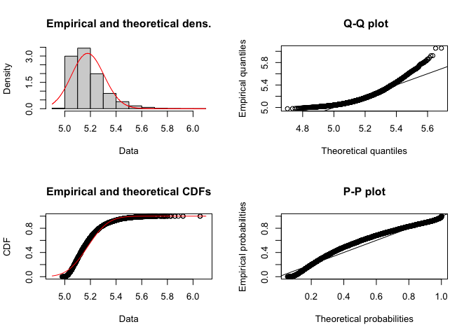
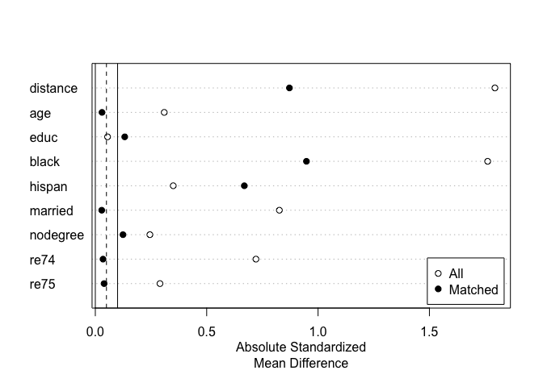
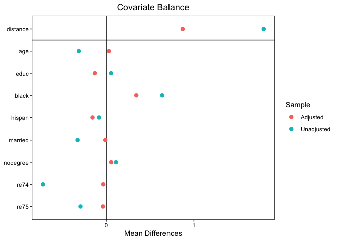
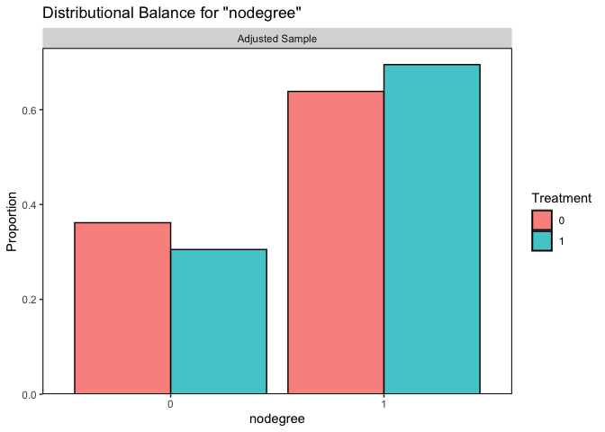
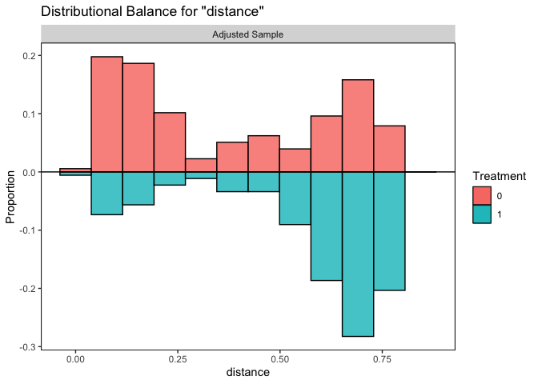
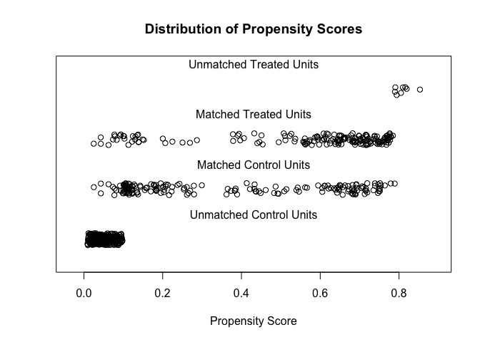
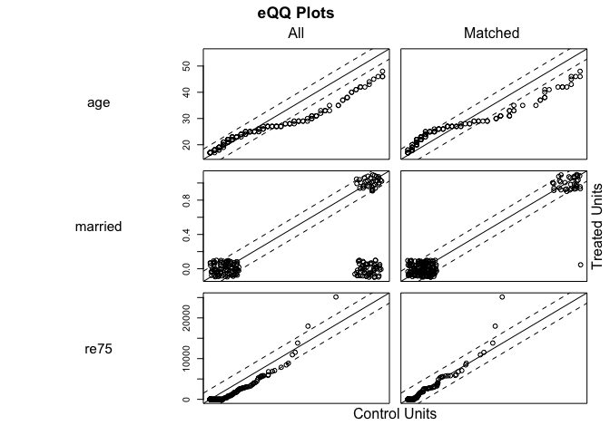
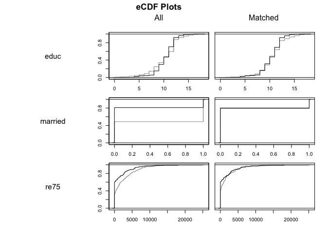

Lalonde
================

## Data io

``` r
data(lalonde)
```

## Lalonde EDA pt. 1

``` r
summary(lalonde)
```

    ##      treat             age             educ           black       
    ##  Min.   :0.0000   Min.   :16.00   Min.   : 0.00   Min.   :0.0000  
    ##  1st Qu.:0.0000   1st Qu.:20.00   1st Qu.: 9.00   1st Qu.:0.0000  
    ##  Median :0.0000   Median :25.00   Median :11.00   Median :0.0000  
    ##  Mean   :0.3013   Mean   :27.36   Mean   :10.27   Mean   :0.3958  
    ##  3rd Qu.:1.0000   3rd Qu.:32.00   3rd Qu.:12.00   3rd Qu.:1.0000  
    ##  Max.   :1.0000   Max.   :55.00   Max.   :18.00   Max.   :1.0000  
    ##      hispan          married          nodegree           re74      
    ##  Min.   :0.0000   Min.   :0.0000   Min.   :0.0000   Min.   :    0  
    ##  1st Qu.:0.0000   1st Qu.:0.0000   1st Qu.:0.0000   1st Qu.:    0  
    ##  Median :0.0000   Median :0.0000   Median :1.0000   Median : 1042  
    ##  Mean   :0.1173   Mean   :0.4153   Mean   :0.6303   Mean   : 4558  
    ##  3rd Qu.:0.0000   3rd Qu.:1.0000   3rd Qu.:1.0000   3rd Qu.: 7888  
    ##  Max.   :1.0000   Max.   :1.0000   Max.   :1.0000   Max.   :35040  
    ##       re75              re78        
    ##  Min.   :    0.0   Min.   :    0.0  
    ##  1st Qu.:    0.0   1st Qu.:  238.3  
    ##  Median :  601.5   Median : 4759.0  
    ##  Mean   : 2184.9   Mean   : 6792.8  
    ##  3rd Qu.: 3249.0   3rd Qu.:10893.6  
    ##  Max.   :25142.2   Max.   :60307.9

``` r
skim(lalonde)
```

<table style='width: auto;'
        class='table table-condensed'>

<caption>

Data summary

</caption>

<thead>

<tr>

<th style="text-align:left;">

</th>

<th style="text-align:left;">

</th>

</tr>

</thead>

<tbody>

<tr>

<td style="text-align:left;">

Name

</td>

<td style="text-align:left;">

lalonde

</td>

</tr>

<tr>

<td style="text-align:left;">

Number of rows

</td>

<td style="text-align:left;">

614

</td>

</tr>

<tr>

<td style="text-align:left;">

Number of columns

</td>

<td style="text-align:left;">

10

</td>

</tr>

<tr>

<td style="text-align:left;">

\_\_\_\_\_\_\_\_\_\_\_\_\_\_\_\_\_\_\_\_\_\_\_

</td>

<td style="text-align:left;">

</td>

</tr>

<tr>

<td style="text-align:left;">

Column type frequency:

</td>

<td style="text-align:left;">

</td>

</tr>

<tr>

<td style="text-align:left;">

numeric

</td>

<td style="text-align:left;">

10

</td>

</tr>

<tr>

<td style="text-align:left;">

\_\_\_\_\_\_\_\_\_\_\_\_\_\_\_\_\_\_\_\_\_\_\_\_

</td>

<td style="text-align:left;">

</td>

</tr>

<tr>

<td style="text-align:left;">

Group variables

</td>

<td style="text-align:left;">

None

</td>

</tr>

</tbody>

</table>

**Variable type: numeric**

<table>

<thead>

<tr>

<th style="text-align:left;">

skim\_variable

</th>

<th style="text-align:right;">

n\_missing

</th>

<th style="text-align:right;">

complete\_rate

</th>

<th style="text-align:right;">

mean

</th>

<th style="text-align:right;">

sd

</th>

<th style="text-align:right;">

p0

</th>

<th style="text-align:right;">

p25

</th>

<th style="text-align:right;">

p50

</th>

<th style="text-align:right;">

p75

</th>

<th style="text-align:right;">

p100

</th>

<th style="text-align:left;">

hist

</th>

</tr>

</thead>

<tbody>

<tr>

<td style="text-align:left;">

treat

</td>

<td style="text-align:right;">

0

</td>

<td style="text-align:right;">

1

</td>

<td style="text-align:right;">

0.30

</td>

<td style="text-align:right;">

0.46

</td>

<td style="text-align:right;">

0

</td>

<td style="text-align:right;">

0.00

</td>

<td style="text-align:right;">

0.00

</td>

<td style="text-align:right;">

1.00

</td>

<td style="text-align:right;">

1.00

</td>

<td style="text-align:left;">

▇▁▁▁▃

</td>

</tr>

<tr>

<td style="text-align:left;">

age

</td>

<td style="text-align:right;">

0

</td>

<td style="text-align:right;">

1

</td>

<td style="text-align:right;">

27.36

</td>

<td style="text-align:right;">

9.88

</td>

<td style="text-align:right;">

16

</td>

<td style="text-align:right;">

20.00

</td>

<td style="text-align:right;">

25.00

</td>

<td style="text-align:right;">

32.00

</td>

<td style="text-align:right;">

55.00

</td>

<td style="text-align:left;">

▇▅▂▂▁

</td>

</tr>

<tr>

<td style="text-align:left;">

educ

</td>

<td style="text-align:right;">

0

</td>

<td style="text-align:right;">

1

</td>

<td style="text-align:right;">

10.27

</td>

<td style="text-align:right;">

2.63

</td>

<td style="text-align:right;">

0

</td>

<td style="text-align:right;">

9.00

</td>

<td style="text-align:right;">

11.00

</td>

<td style="text-align:right;">

12.00

</td>

<td style="text-align:right;">

18.00

</td>

<td style="text-align:left;">

▁▂▆▇▁

</td>

</tr>

<tr>

<td style="text-align:left;">

black

</td>

<td style="text-align:right;">

0

</td>

<td style="text-align:right;">

1

</td>

<td style="text-align:right;">

0.40

</td>

<td style="text-align:right;">

0.49

</td>

<td style="text-align:right;">

0

</td>

<td style="text-align:right;">

0.00

</td>

<td style="text-align:right;">

0.00

</td>

<td style="text-align:right;">

1.00

</td>

<td style="text-align:right;">

1.00

</td>

<td style="text-align:left;">

▇▁▁▁▅

</td>

</tr>

<tr>

<td style="text-align:left;">

hispan

</td>

<td style="text-align:right;">

0

</td>

<td style="text-align:right;">

1

</td>

<td style="text-align:right;">

0.12

</td>

<td style="text-align:right;">

0.32

</td>

<td style="text-align:right;">

0

</td>

<td style="text-align:right;">

0.00

</td>

<td style="text-align:right;">

0.00

</td>

<td style="text-align:right;">

0.00

</td>

<td style="text-align:right;">

1.00

</td>

<td style="text-align:left;">

▇▁▁▁▁

</td>

</tr>

<tr>

<td style="text-align:left;">

married

</td>

<td style="text-align:right;">

0

</td>

<td style="text-align:right;">

1

</td>

<td style="text-align:right;">

0.42

</td>

<td style="text-align:right;">

0.49

</td>

<td style="text-align:right;">

0

</td>

<td style="text-align:right;">

0.00

</td>

<td style="text-align:right;">

0.00

</td>

<td style="text-align:right;">

1.00

</td>

<td style="text-align:right;">

1.00

</td>

<td style="text-align:left;">

▇▁▁▁▆

</td>

</tr>

<tr>

<td style="text-align:left;">

nodegree

</td>

<td style="text-align:right;">

0

</td>

<td style="text-align:right;">

1

</td>

<td style="text-align:right;">

0.63

</td>

<td style="text-align:right;">

0.48

</td>

<td style="text-align:right;">

0

</td>

<td style="text-align:right;">

0.00

</td>

<td style="text-align:right;">

1.00

</td>

<td style="text-align:right;">

1.00

</td>

<td style="text-align:right;">

1.00

</td>

<td style="text-align:left;">

▅▁▁▁▇

</td>

</tr>

<tr>

<td style="text-align:left;">

re74

</td>

<td style="text-align:right;">

0

</td>

<td style="text-align:right;">

1

</td>

<td style="text-align:right;">

4557.55

</td>

<td style="text-align:right;">

6477.96

</td>

<td style="text-align:right;">

0

</td>

<td style="text-align:right;">

0.00

</td>

<td style="text-align:right;">

1042.33

</td>

<td style="text-align:right;">

7888.50

</td>

<td style="text-align:right;">

35040.07

</td>

<td style="text-align:left;">

▇▂▁▁▁

</td>

</tr>

<tr>

<td style="text-align:left;">

re75

</td>

<td style="text-align:right;">

0

</td>

<td style="text-align:right;">

1

</td>

<td style="text-align:right;">

2184.94

</td>

<td style="text-align:right;">

3295.68

</td>

<td style="text-align:right;">

0

</td>

<td style="text-align:right;">

0.00

</td>

<td style="text-align:right;">

601.55

</td>

<td style="text-align:right;">

3248.99

</td>

<td style="text-align:right;">

25142.24

</td>

<td style="text-align:left;">

▇▁▁▁▁

</td>

</tr>

<tr>

<td style="text-align:left;">

re78

</td>

<td style="text-align:right;">

0

</td>

<td style="text-align:right;">

1

</td>

<td style="text-align:right;">

6792.83

</td>

<td style="text-align:right;">

7470.73

</td>

<td style="text-align:right;">

0

</td>

<td style="text-align:right;">

238.28

</td>

<td style="text-align:right;">

4759.02

</td>

<td style="text-align:right;">

10893.59

</td>

<td style="text-align:right;">

60307.93

</td>

<td style="text-align:left;">

▇▂▁▁▁

</td>

</tr>

</tbody>

</table>

``` r
df_status(lalonde)
```

    ##    variable q_zeros p_zeros q_na p_na q_inf p_inf    type unique
    ## 1     treat     429   69.87    0    0     0     0 integer      2
    ## 2       age       0    0.00    0    0     0     0 integer     40
    ## 3      educ       3    0.49    0    0     0     0 integer     19
    ## 4     black     371   60.42    0    0     0     0 integer      2
    ## 5    hispan     542   88.27    0    0     0     0 integer      2
    ## 6   married     359   58.47    0    0     0     0 integer      2
    ## 7  nodegree     227   36.97    0    0     0     0 integer      2
    ## 8      re74     243   39.58    0    0     0     0 numeric    358
    ## 9      re75     245   39.90    0    0     0     0 numeric    356
    ## 10     re78     143   23.29    0    0     0     0 numeric    457

## Lalonde EDA, pt. 2

``` r
lalonde %>% 
  group_by(treat) %>% 
  count(sort = TRUE, wt = age, name = "subjects")
```

    ## # A tibble: 2 x 2
    ## # Groups:   treat [2]
    ##   treat subjects
    ##   <int>    <int>
    ## 1     0    12025
    ## 2     1     4776

``` r
lalonde %>% 
  group_by(treat) %>% 
  count(decile = 10 * (age %/% 10))
```

    ## # A tibble: 9 x 3
    ## # Groups:   treat [2]
    ##   treat decile     n
    ##   <int>  <dbl> <int>
    ## 1     0     10   115
    ## 2     0     20   166
    ## 3     0     30    71
    ## 4     0     40    51
    ## 5     0     50    26
    ## 6     1     10    38
    ## 7     1     20   108
    ## 8     1     30    24
    ## 9     1     40    15

## Lalonde EDA, pt. 3

``` r
summary(lalonde$re78)
```

    ##    Min. 1st Qu.  Median    Mean 3rd Qu.    Max. 
    ##     0.0   238.3  4759.0  6792.8 10893.6 60307.9

``` r
describe(lalonde$re78)
```

    ## lalonde$re78 
    ##        n  missing distinct     Info     Mean      Gmd      .05      .10 
    ##      614        0      457    0.987     6793     7807      0.0      0.0 
    ##      .25      .50      .75      .90      .95 
    ##    238.3   4759.0  10893.6  17800.1  21691.8 
    ## 
    ## lowest :     0.00000    31.03226    33.98771    54.67588    94.57450
    ## highest: 26372.28000 26817.60000 34099.28000 36646.95000 60307.93000

``` r
hist(lalonde$re78, )
```

<!-- -->

``` r
hist(log(lalonde$re78))
```

<!-- -->

``` r
ggplot(lalonde, aes(x=age)) + 
  geom_histogram(binwidth=2,colour="white",fill="skyblue") +
  facet_grid(. ~ treat)
```

<!-- -->

## Distribution Fitting

``` r
hist(rgamma(100,2,11))
```

<!-- -->

``` r
hist(rnorm(100,5,.01))
```

<!-- -->

``` r
x <- rgamma(10000,2,11) + rnorm(10000,5,.01)
fit.gamma <- fitdist(x, distr = "gamma", method = "mle")
summary(fit.gamma)
```

    ## Fitting of the distribution ' gamma ' by maximum likelihood 
    ## Parameters : 
    ##        estimate Std. Error
    ## shape 1672.6215  23.652321
    ## rate   322.8423   4.565953
    ## Loglikelihood:  6473.97   AIC:  -12943.94   BIC:  -12929.52 
    ## Correlation matrix:
    ##           shape      rate
    ## shape 1.0000000 0.9998505
    ## rate  0.9998505 1.0000000

``` r
plot(fit.gamma)
```

<!-- -->

``` r
# lalonde_gamma <- fitdist(lalonde$re78 + 1, distr = "gamma", method = "mle")
# summary(lalonde_gamma)
# plot(lalonde_gamma)
```

## Matching

``` r
match_1 <- matchit(formula = treat ~ age + educ + black + hispan + married + 
                   nodegree + re74 + re75, 
        method = "nearest",
        data = lalonde,
        discard = "both", 
        replace = FALSE, 
        #caliper = c(),
        #std.caliper = c(),
        ratio = 1)

match_1
```

    ## A matchit object
    ##  - method: 1:1 nearest neighbor matching without replacement
    ##  - distance: Propensity score [common support]
    ##              - estimated with logistic regression
    ##  - common support: units from both groups dropped
    ##  - number of obs.: 614 (original), 354 (matched)
    ##  - target estimand: ATT
    ##  - covariates: age, educ, black, hispan, married, nodegree, re74, re75

``` r
summary(match_1, subclass = TRUE, un = FALSE)
```

    ## 
    ## Call:
    ## matchit(formula = treat ~ age + educ + black + hispan + married + 
    ##     nodegree + re74 + re75, data = lalonde, method = "nearest", 
    ##     discard = "both", replace = FALSE, ratio = 1)
    ## 
    ## Summary of Balance for Matched Data:
    ##          Means Treated Means Control Std. Mean Diff. Var. Ratio eCDF Mean
    ## distance        0.5669        0.3750          0.8715     0.7562    0.1139
    ## age            25.4463       25.2316          0.0300     0.4336    0.0870
    ## educ           10.3220       10.5876         -0.1321     0.6076    0.0235
    ## black           0.8362        0.4915          0.9479          .    0.3446
    ## hispan          0.0621        0.2203         -0.6689          .    0.1582
    ## married         0.1977        0.2090         -0.0289          .    0.0113
    ## nodegree        0.6949        0.6384          0.1243          .    0.0565
    ## re74         2179.3904     2348.2864         -0.0346     1.3547    0.0423
    ## re75         1485.9177     1612.6659         -0.0394     1.4896    0.0491
    ##          eCDF Max Std. Pair Dist.
    ## distance   0.3955          0.8718
    ## age        0.2486          1.4087
    ## educ       0.0678          1.2392
    ## black      0.3446          0.9479
    ## hispan     0.1582          1.0512
    ## married    0.0113          0.8655
    ## nodegree   0.0565          0.8450
    ## re74       0.2542          0.7408
    ## re75       0.2034          0.7366
    ## 
    ## Sample Sizes:
    ##           Control Treated
    ## All           429     185
    ## Matched       177     177
    ## Unmatched     195       0
    ## Discarded      57       8

#### Match diagnostics

``` r
plot(summary(match_1))
```

<!-- -->

``` r
love.plot(bal.tab(match_1), stars = "std")
```

<!-- -->

``` r
# Examining distributional balance with plots:
bal.plot(match_1, var.name = "nodegree")
```

<!-- -->

``` r
bal.plot(match_1, var.name = "distance", mirror = TRUE, type = "histogram")
```

<!-- -->

``` r
plot(match_1, type = "jitter", interactive = FALSE)
```

<!-- -->

``` r
plot(match_1, type = "qq", interactive = FALSE,
     which.xs = c("age", "married", "re75"))
```

<!-- -->

``` r
#eCDF plot
plot(match_1, type = "ecdf", which.xs = c("educ", "married", "re75"))
```

<!-- -->

## Matched data

``` r
match_1_data <- match.data(match_1)

head(match_1_data)
```

    ##   treat age educ black hispan married nodegree re74 re75       re78  distance
    ## 1     1  37   11     1      0       1        1    0    0  9930.0460 0.6387699
    ## 2     1  22    9     0      1       0        1    0    0  3595.8940 0.2246342
    ## 3     1  30   12     1      0       0        0    0    0 24909.4500 0.6782439
    ## 4     1  27   11     1      0       0        1    0    0  7506.1460 0.7763241
    ## 5     1  33    8     1      0       0        1    0    0   289.7899 0.7016387
    ## 6     1  22    9     1      0       0        1    0    0  4056.4940 0.6990699
    ##   weights subclass
    ## 1       1        1
    ## 2       1       94
    ## 3       1      105
    ## 4       1      116
    ## 5       1      127
    ## 6       1      138

## Linear Modeling

#### Assumptions:

  - Linearity
  - Homoscedasticity
  - Independence
  - Normality

<http://www.sthda.com/english/articles/39-regression-model-diagnostics/161-linear-regression-assumptions-and-diagnostics-in-r-essentials/>

<https://data.library.virginia.edu/diagnostic-plots/>

``` r
plot(lalonde$re78)
```

<!-- -->

``` r
# Pre-match data:
prematch_lm <- lm(re78 ~ treat, data = lalonde)

# Matched data:
matched_lm <- lm(re78 ~ treat, data = match.data(match_1), weights = weights)


autoplot(prematch_lm) +
  theme_abyss()
```

    ## Warning: `arrange_()` is deprecated as of dplyr 0.7.0.
    ## Please use `arrange()` instead.
    ## See vignette('programming') for more help
    ## This warning is displayed once every 8 hours.
    ## Call `lifecycle::last_warnings()` to see where this warning was generated.

<!-- -->

``` r
  #theme_minimal() + 
  #theme_ft_rc()
```

## Estimating the Treatment Effect

<https://kosukeimai.github.io/MatchIt/articles/MatchIt.html>

How treatment effects are estimated depends on what form of matching was
performed. See vignette(“estimating-effects”) for information on the
variety of way to estimate effects and standard errors after each type
of matching and for several outcome types. After 1:1 matching without
replacement (i.e., the first matching specification above), we can run a
simple regression of the outcome on the treatment in the matched sample
(i.e., including the matching weights). With continuous outcomes, it is
often a good idea to also include the covariates used in the matching in
the effect estimation, as doing so can provide additional robustness to
slight imbalances remaining after the matching and can improve
precision.

Even though the 1:1 matching was not successful, we’ll demonstrate here
how to estimate a treatment effect after performing such an analysis.
First, we’ll extract the matched dataset from the matchit object using
match.data(). This dataset only contains the matched units and adds
columns for distance, weights, and subclass (described previously).

We can then estimate a treatment effect in this dataset using the
standard regression functions in R, like lm() or glm(), being sure to
include the matching weights (stored in the weights variable of the
match.data() output) in the estimation3. We recommend using
cluster-robust standard errors for most analyses, with pair membership
as the clustering variable; the lmtest and sandwich packages together
make this straightforward.

``` r
library("lmtest") #coeftest
library("sandwich") #vcovCL

fit1 <- lm(re78 ~ treat + age + educ + black + hispan + married + nodegree + 
             re74 + re75, 
           data = match_1_data, 
           weights = weights)

coeftest(fit1, vcov. = vcovCL, cluster = ~subclass)
```

    ## 
    ## t test of coefficients:
    ## 
    ##                Estimate  Std. Error t value Pr(>|t|)  
    ## (Intercept)  888.366052 3130.466960  0.2838  0.77675  
    ## treat       1116.038833  709.421069  1.5732  0.11660  
    ## age           -8.373257   41.839702 -0.2001  0.84150  
    ## educ         426.186450  193.915458  2.1978  0.02863 *
    ## black       -917.343709  947.193306 -0.9685  0.33348  
    ## hispan       762.385292 1197.871812  0.6364  0.52491  
    ## married     -129.340891  925.027275 -0.1398  0.88888  
    ## nodegree     273.837364 1068.170639  0.2564  0.79783  
    ## re74           0.034354    0.168952  0.2033  0.83899  
    ## re75           0.250141    0.161806  1.5459  0.12304  
    ## ---
    ## Signif. codes:  0 '***' 0.001 '**' 0.01 '*' 0.05 '.' 0.1 ' ' 1

## Uncertainty / confidence intervals

<https://kosukeimai.github.io/MatchIt/articles/estimating-effects.html#after-pair-matching-with-replacement-1>

``` r
#Block bootstrap confidence interval
# library(boot)

pair_ids <- levels(match_1_data$subclass)

est_fun <- function(pairs, i) {
  
  #Compute number of times each pair is present
  numreps <- table(pairs[i])
  
  #For each pair p, copy corresponding md row indices numreps[p] times
  ids <- unlist(lapply(pair_ids[pair_ids %in% names(numreps)],
                       function(p) rep(which(match_1_data$subclass == p), 
                                              numreps[p])))
  
  #Subset md with block bootstrapped ids
  md_boot <- match_1_data[ids,]
  
  #Effect estimation
  fit_boot <- lm(re78 ~ treat,
                 data = md_boot,
                 weights = weights)
  
  #Return the coefficient on treatment
  return(coef(fit_boot)["treat"])
}

boot_est <- boot(pair_ids, est_fun, R = 499)
boot_est
```

    ## 
    ## ORDINARY NONPARAMETRIC BOOTSTRAP
    ## 
    ## 
    ## Call:
    ## boot(data = pair_ids, statistic = est_fun, R = 499)
    ## 
    ## 
    ## Bootstrap Statistics :
    ##     original    bias    std. error
    ## t1* 543.7484 -25.97893     682.619

``` r
boot.ci(boot_est, type = "bca")
```

    ## BOOTSTRAP CONFIDENCE INTERVAL CALCULATIONS
    ## Based on 499 bootstrap replicates
    ## 
    ## CALL : 
    ## boot.ci(boot.out = boot_est, type = "bca")
    ## 
    ## Intervals : 
    ## Level       BCa          
    ## 95%   (-644.5, 2048.3 )  
    ## Calculations and Intervals on Original Scale
    ## Some BCa intervals may be unstable

<https://moderndive.com/10-inference-for-regression.html> is another
helpful resource in addition to the above link from Kosuke Imai

## Generalized Linear Modeling

  - Get help page:
  - ?family

See <https://fromthebottomoftheheap.net/2016/06/07/rootograms/>

``` r
# Gaussian-distributed residuals and identity link = OLS:
gaussian_identity <- glm(re78 ~ treat, data = lalonde, family=gaussian(link = "identity"))
summary(gaussian_identity)
```

    ## 
    ## Call:
    ## glm(formula = re78 ~ treat, family = gaussian(link = "identity"), 
    ##     data = lalonde)
    ## 
    ## Deviance Residuals: 
    ##    Min      1Q  Median      3Q     Max  
    ##  -6984   -6349   -2048    4100   53959  
    ## 
    ## Coefficients:
    ##             Estimate Std. Error t value Pr(>|t|)    
    ## (Intercept)   6984.2      360.7  19.362   <2e-16 ***
    ## treat         -635.0      657.1  -0.966    0.334    
    ## ---
    ## Signif. codes:  0 '***' 0.001 '**' 0.01 '*' 0.05 '.' 0.1 ' ' 1
    ## 
    ## (Dispersion parameter for gaussian family taken to be 55817843)
    ## 
    ##     Null deviance: 3.4213e+10  on 613  degrees of freedom
    ## Residual deviance: 3.4161e+10  on 612  degrees of freedom
    ## AIC: 12699
    ## 
    ## Number of Fisher Scoring iterations: 2

``` r
# Gamma default link is "inverse"
gamma_inverse <- glm(re78 + 1 ~ treat, data = lalonde, family=Gamma(link = "inverse"))
summary(gamma_inverse)
```

    ## 
    ## Call:
    ## glm(formula = re78 + 1 ~ treat, family = Gamma(link = "inverse"), 
    ##     data = lalonde)
    ## 
    ## Deviance Residuals: 
    ##     Min       1Q   Median       3Q      Max  
    ## -3.9627  -2.1946  -0.3500   0.5049   3.5345  
    ## 
    ## Coefficients:
    ##              Estimate Std. Error t value Pr(>|t|)    
    ## (Intercept) 1.432e-04  7.648e-06   18.72   <2e-16 ***
    ## treat       1.432e-05  1.492e-05    0.96    0.338    
    ## ---
    ## Signif. codes:  0 '***' 0.001 '**' 0.01 '*' 0.05 '.' 0.1 ' ' 1
    ## 
    ## (Dispersion parameter for Gamma family taken to be 1.224413)
    ## 
    ##     Null deviance: 2723.5  on 613  degrees of freedom
    ## Residual deviance: 2722.4  on 612  degrees of freedom
    ## AIC: 11137
    ## 
    ## Number of Fisher Scoring iterations: 6

``` r
# Using log link
gamma_log <- glm(re78 + 1 ~ treat, data = lalonde, family=Gamma(link = "log"))
summary(gamma_log)
```

    ## 
    ## Call:
    ## glm(formula = re78 + 1 ~ treat, family = Gamma(link = "log"), 
    ##     data = lalonde)
    ## 
    ## Deviance Residuals: 
    ##     Min       1Q   Median       3Q      Max  
    ## -3.9627  -2.1946  -0.3500   0.5049   3.5345  
    ## 
    ## Coefficients:
    ##             Estimate Std. Error t value Pr(>|t|)    
    ## (Intercept)  8.85154    0.05342 165.708   <2e-16 ***
    ## treat       -0.09531    0.09731  -0.979    0.328    
    ## ---
    ## Signif. codes:  0 '***' 0.001 '**' 0.01 '*' 0.05 '.' 0.1 ' ' 1
    ## 
    ## (Dispersion parameter for Gamma family taken to be 1.224076)
    ## 
    ##     Null deviance: 2723.5  on 613  degrees of freedom
    ## Residual deviance: 2722.4  on 612  degrees of freedom
    ## AIC: 11137
    ## 
    ## Number of Fisher Scoring iterations: 12

``` r
plot(rstudent(gamma_log))
```

<!-- -->

``` r
plot(influence(gamma_log)$hat)
```

<!-- -->

``` r
plot(cooks.distance(gamma_log))
```

<!-- -->

## Logistic GLM

``` r
# Logistic regression is binomial with "logit" link
logistic_mod <- glm(treat ~ re74 + re75, data = lalonde, family = binomial(link="logit"))
# Output of above will be log-odds in the "estimate" column
# By exponentiating the coefficients, we can get the odds
exp(logistic_mod$coef)
```

    ## (Intercept)        re74        re75 
    ##   0.6455863   0.9998713   1.0000247

``` r
summary(logistic_mod)
```

    ## 
    ## Call:
    ## glm(formula = treat ~ re74 + re75, family = binomial(link = "logit"), 
    ##     data = lalonde)
    ## 
    ## Deviance Residuals: 
    ##     Min       1Q   Median       3Q      Max  
    ## -1.0694  -0.9714  -0.6520   1.3680   3.0568  
    ## 
    ## Coefficients:
    ##               Estimate Std. Error z value Pr(>|z|)    
    ## (Intercept) -4.376e-01  1.100e-01  -3.978 6.95e-05 ***
    ## re74        -1.287e-04  2.532e-05  -5.084 3.69e-07 ***
    ## re75         2.472e-05  3.960e-05   0.624    0.533    
    ## ---
    ## Signif. codes:  0 '***' 0.001 '**' 0.01 '*' 0.05 '.' 0.1 ' ' 1
    ## 
    ## (Dispersion parameter for binomial family taken to be 1)
    ## 
    ##     Null deviance: 751.49  on 613  degrees of freedom
    ## Residual deviance: 704.15  on 611  degrees of freedom
    ## AIC: 710.15
    ## 
    ## Number of Fisher Scoring iterations: 5

``` r
confint(logistic_mod)
```

    ## Waiting for profiling to be done...

    ##                     2.5 %        97.5 %
    ## (Intercept) -6.545392e-01 -0.2229904520
    ## re74        -1.813279e-04 -0.0000818306
    ## re75        -5.496683e-05  0.0001009886
