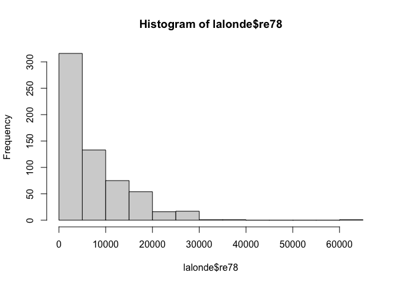
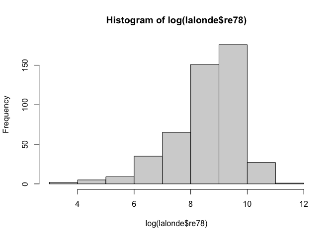
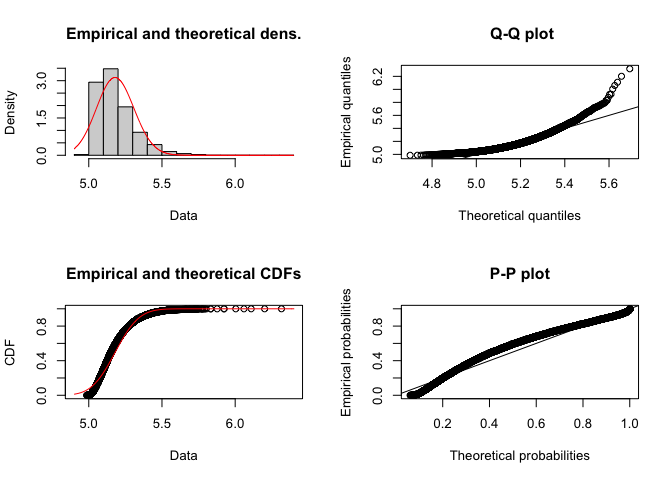
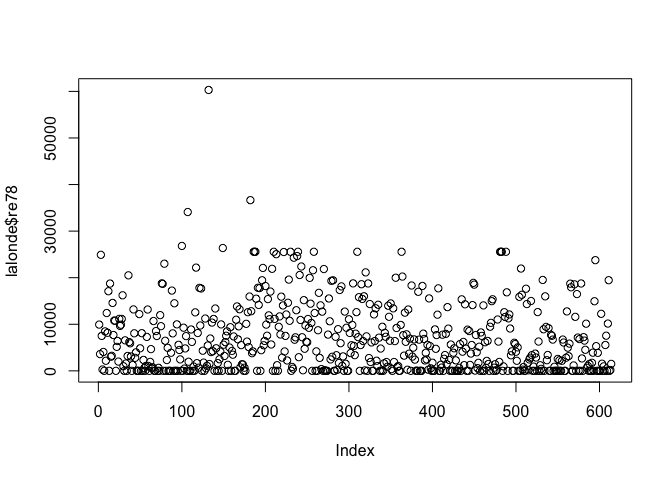
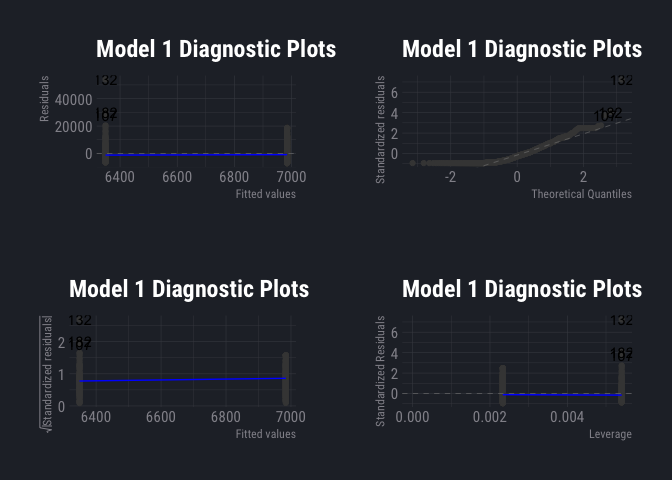
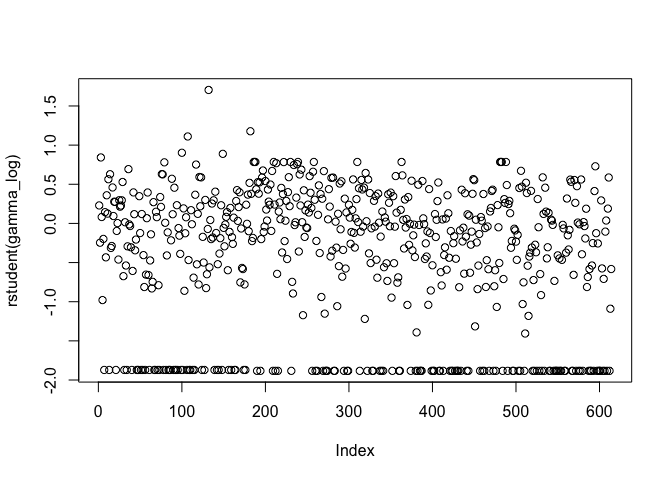
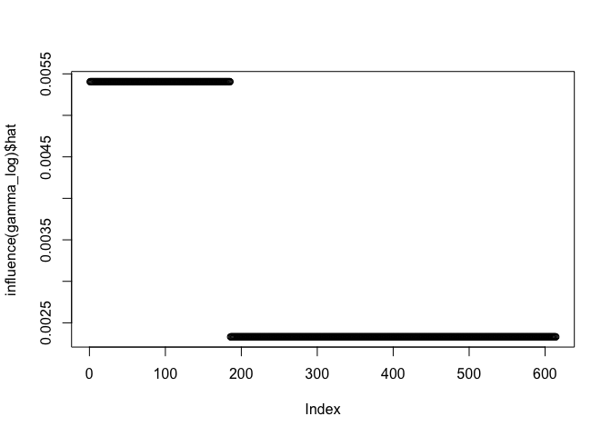
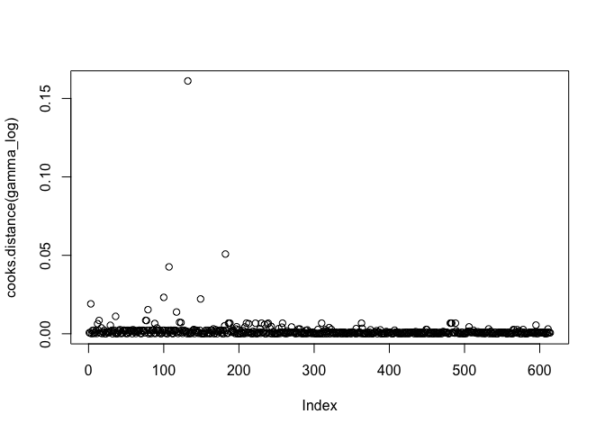

Lalonde
================

## Data io

``` r
data(lalonde)
```

## Lalonde EDA pt. 1

``` r
summary(lalonde)
```

    ##      treat             age             educ           black       
    ##  Min.   :0.0000   Min.   :16.00   Min.   : 0.00   Min.   :0.0000  
    ##  1st Qu.:0.0000   1st Qu.:20.00   1st Qu.: 9.00   1st Qu.:0.0000  
    ##  Median :0.0000   Median :25.00   Median :11.00   Median :0.0000  
    ##  Mean   :0.3013   Mean   :27.36   Mean   :10.27   Mean   :0.3958  
    ##  3rd Qu.:1.0000   3rd Qu.:32.00   3rd Qu.:12.00   3rd Qu.:1.0000  
    ##  Max.   :1.0000   Max.   :55.00   Max.   :18.00   Max.   :1.0000  
    ##      hispan          married          nodegree           re74      
    ##  Min.   :0.0000   Min.   :0.0000   Min.   :0.0000   Min.   :    0  
    ##  1st Qu.:0.0000   1st Qu.:0.0000   1st Qu.:0.0000   1st Qu.:    0  
    ##  Median :0.0000   Median :0.0000   Median :1.0000   Median : 1042  
    ##  Mean   :0.1173   Mean   :0.4153   Mean   :0.6303   Mean   : 4558  
    ##  3rd Qu.:0.0000   3rd Qu.:1.0000   3rd Qu.:1.0000   3rd Qu.: 7888  
    ##  Max.   :1.0000   Max.   :1.0000   Max.   :1.0000   Max.   :35040  
    ##       re75              re78        
    ##  Min.   :    0.0   Min.   :    0.0  
    ##  1st Qu.:    0.0   1st Qu.:  238.3  
    ##  Median :  601.5   Median : 4759.0  
    ##  Mean   : 2184.9   Mean   : 6792.8  
    ##  3rd Qu.: 3249.0   3rd Qu.:10893.6  
    ##  Max.   :25142.2   Max.   :60307.9

``` r
skim(lalonde)
```

<table style='width: auto;'
        class='table table-condensed'>

<caption>

Data summary

</caption>

<thead>

<tr>

<th style="text-align:left;">

</th>

<th style="text-align:left;">

</th>

</tr>

</thead>

<tbody>

<tr>

<td style="text-align:left;">

Name

</td>

<td style="text-align:left;">

lalonde

</td>

</tr>

<tr>

<td style="text-align:left;">

Number of rows

</td>

<td style="text-align:left;">

614

</td>

</tr>

<tr>

<td style="text-align:left;">

Number of columns

</td>

<td style="text-align:left;">

10

</td>

</tr>

<tr>

<td style="text-align:left;">

\_\_\_\_\_\_\_\_\_\_\_\_\_\_\_\_\_\_\_\_\_\_\_

</td>

<td style="text-align:left;">

</td>

</tr>

<tr>

<td style="text-align:left;">

Column type frequency:

</td>

<td style="text-align:left;">

</td>

</tr>

<tr>

<td style="text-align:left;">

numeric

</td>

<td style="text-align:left;">

10

</td>

</tr>

<tr>

<td style="text-align:left;">

\_\_\_\_\_\_\_\_\_\_\_\_\_\_\_\_\_\_\_\_\_\_\_\_

</td>

<td style="text-align:left;">

</td>

</tr>

<tr>

<td style="text-align:left;">

Group variables

</td>

<td style="text-align:left;">

None

</td>

</tr>

</tbody>

</table>

**Variable type: numeric**

<table>

<thead>

<tr>

<th style="text-align:left;">

skim\_variable

</th>

<th style="text-align:right;">

n\_missing

</th>

<th style="text-align:right;">

complete\_rate

</th>

<th style="text-align:right;">

mean

</th>

<th style="text-align:right;">

sd

</th>

<th style="text-align:right;">

p0

</th>

<th style="text-align:right;">

p25

</th>

<th style="text-align:right;">

p50

</th>

<th style="text-align:right;">

p75

</th>

<th style="text-align:right;">

p100

</th>

<th style="text-align:left;">

hist

</th>

</tr>

</thead>

<tbody>

<tr>

<td style="text-align:left;">

treat

</td>

<td style="text-align:right;">

0

</td>

<td style="text-align:right;">

1

</td>

<td style="text-align:right;">

0.30

</td>

<td style="text-align:right;">

0.46

</td>

<td style="text-align:right;">

0

</td>

<td style="text-align:right;">

0.00

</td>

<td style="text-align:right;">

0.00

</td>

<td style="text-align:right;">

1.00

</td>

<td style="text-align:right;">

1.00

</td>

<td style="text-align:left;">

▇▁▁▁▃

</td>

</tr>

<tr>

<td style="text-align:left;">

age

</td>

<td style="text-align:right;">

0

</td>

<td style="text-align:right;">

1

</td>

<td style="text-align:right;">

27.36

</td>

<td style="text-align:right;">

9.88

</td>

<td style="text-align:right;">

16

</td>

<td style="text-align:right;">

20.00

</td>

<td style="text-align:right;">

25.00

</td>

<td style="text-align:right;">

32.00

</td>

<td style="text-align:right;">

55.00

</td>

<td style="text-align:left;">

▇▅▂▂▁

</td>

</tr>

<tr>

<td style="text-align:left;">

educ

</td>

<td style="text-align:right;">

0

</td>

<td style="text-align:right;">

1

</td>

<td style="text-align:right;">

10.27

</td>

<td style="text-align:right;">

2.63

</td>

<td style="text-align:right;">

0

</td>

<td style="text-align:right;">

9.00

</td>

<td style="text-align:right;">

11.00

</td>

<td style="text-align:right;">

12.00

</td>

<td style="text-align:right;">

18.00

</td>

<td style="text-align:left;">

▁▂▆▇▁

</td>

</tr>

<tr>

<td style="text-align:left;">

black

</td>

<td style="text-align:right;">

0

</td>

<td style="text-align:right;">

1

</td>

<td style="text-align:right;">

0.40

</td>

<td style="text-align:right;">

0.49

</td>

<td style="text-align:right;">

0

</td>

<td style="text-align:right;">

0.00

</td>

<td style="text-align:right;">

0.00

</td>

<td style="text-align:right;">

1.00

</td>

<td style="text-align:right;">

1.00

</td>

<td style="text-align:left;">

▇▁▁▁▅

</td>

</tr>

<tr>

<td style="text-align:left;">

hispan

</td>

<td style="text-align:right;">

0

</td>

<td style="text-align:right;">

1

</td>

<td style="text-align:right;">

0.12

</td>

<td style="text-align:right;">

0.32

</td>

<td style="text-align:right;">

0

</td>

<td style="text-align:right;">

0.00

</td>

<td style="text-align:right;">

0.00

</td>

<td style="text-align:right;">

0.00

</td>

<td style="text-align:right;">

1.00

</td>

<td style="text-align:left;">

▇▁▁▁▁

</td>

</tr>

<tr>

<td style="text-align:left;">

married

</td>

<td style="text-align:right;">

0

</td>

<td style="text-align:right;">

1

</td>

<td style="text-align:right;">

0.42

</td>

<td style="text-align:right;">

0.49

</td>

<td style="text-align:right;">

0

</td>

<td style="text-align:right;">

0.00

</td>

<td style="text-align:right;">

0.00

</td>

<td style="text-align:right;">

1.00

</td>

<td style="text-align:right;">

1.00

</td>

<td style="text-align:left;">

▇▁▁▁▆

</td>

</tr>

<tr>

<td style="text-align:left;">

nodegree

</td>

<td style="text-align:right;">

0

</td>

<td style="text-align:right;">

1

</td>

<td style="text-align:right;">

0.63

</td>

<td style="text-align:right;">

0.48

</td>

<td style="text-align:right;">

0

</td>

<td style="text-align:right;">

0.00

</td>

<td style="text-align:right;">

1.00

</td>

<td style="text-align:right;">

1.00

</td>

<td style="text-align:right;">

1.00

</td>

<td style="text-align:left;">

▅▁▁▁▇

</td>

</tr>

<tr>

<td style="text-align:left;">

re74

</td>

<td style="text-align:right;">

0

</td>

<td style="text-align:right;">

1

</td>

<td style="text-align:right;">

4557.55

</td>

<td style="text-align:right;">

6477.96

</td>

<td style="text-align:right;">

0

</td>

<td style="text-align:right;">

0.00

</td>

<td style="text-align:right;">

1042.33

</td>

<td style="text-align:right;">

7888.50

</td>

<td style="text-align:right;">

35040.07

</td>

<td style="text-align:left;">

▇▂▁▁▁

</td>

</tr>

<tr>

<td style="text-align:left;">

re75

</td>

<td style="text-align:right;">

0

</td>

<td style="text-align:right;">

1

</td>

<td style="text-align:right;">

2184.94

</td>

<td style="text-align:right;">

3295.68

</td>

<td style="text-align:right;">

0

</td>

<td style="text-align:right;">

0.00

</td>

<td style="text-align:right;">

601.55

</td>

<td style="text-align:right;">

3248.99

</td>

<td style="text-align:right;">

25142.24

</td>

<td style="text-align:left;">

▇▁▁▁▁

</td>

</tr>

<tr>

<td style="text-align:left;">

re78

</td>

<td style="text-align:right;">

0

</td>

<td style="text-align:right;">

1

</td>

<td style="text-align:right;">

6792.83

</td>

<td style="text-align:right;">

7470.73

</td>

<td style="text-align:right;">

0

</td>

<td style="text-align:right;">

238.28

</td>

<td style="text-align:right;">

4759.02

</td>

<td style="text-align:right;">

10893.59

</td>

<td style="text-align:right;">

60307.93

</td>

<td style="text-align:left;">

▇▂▁▁▁

</td>

</tr>

</tbody>

</table>

``` r
df_status(lalonde)
```

    ##    variable q_zeros p_zeros q_na p_na q_inf p_inf    type unique
    ## 1     treat     429   69.87    0    0     0     0 integer      2
    ## 2       age       0    0.00    0    0     0     0 integer     40
    ## 3      educ       3    0.49    0    0     0     0 integer     19
    ## 4     black     371   60.42    0    0     0     0 integer      2
    ## 5    hispan     542   88.27    0    0     0     0 integer      2
    ## 6   married     359   58.47    0    0     0     0 integer      2
    ## 7  nodegree     227   36.97    0    0     0     0 integer      2
    ## 8      re74     243   39.58    0    0     0     0 numeric    358
    ## 9      re75     245   39.90    0    0     0     0 numeric    356
    ## 10     re78     143   23.29    0    0     0     0 numeric    457

## Lalonde EDA, pt. 2

``` r
lalonde %>% 
  group_by(treat) %>% 
  count(sort = TRUE, wt = age, name = "subjects")
```

    ## # A tibble: 2 x 2
    ## # Groups:   treat [2]
    ##   treat subjects
    ##   <int>    <int>
    ## 1     0    12025
    ## 2     1     4776

``` r
lalonde %>% 
  group_by(treat) %>% 
  count(decile = 10 * (age %/% 10))
```

    ## # A tibble: 9 x 3
    ## # Groups:   treat [2]
    ##   treat decile     n
    ##   <int>  <dbl> <int>
    ## 1     0     10   115
    ## 2     0     20   166
    ## 3     0     30    71
    ## 4     0     40    51
    ## 5     0     50    26
    ## 6     1     10    38
    ## 7     1     20   108
    ## 8     1     30    24
    ## 9     1     40    15

## Lalonde EDA, pt. 3

``` r
summary(lalonde$re78)
```

    ##    Min. 1st Qu.  Median    Mean 3rd Qu.    Max. 
    ##     0.0   238.3  4759.0  6792.8 10893.6 60307.9

``` r
describe(lalonde$re78)
```

    ## lalonde$re78 
    ##        n  missing distinct     Info     Mean      Gmd      .05      .10 
    ##      614        0      457    0.987     6793     7807      0.0      0.0 
    ##      .25      .50      .75      .90      .95 
    ##    238.3   4759.0  10893.6  17800.1  21691.8 
    ## 
    ## lowest :     0.00000    31.03226    33.98771    54.67588    94.57450
    ## highest: 26372.28000 26817.60000 34099.28000 36646.95000 60307.93000

``` r
hist(lalonde$re78, )
```

<!-- -->

``` r
hist(log(lalonde$re78))
```

<!-- -->

## Distribution Fitting

``` r
rgamma(100,2,11)
```

    ##   [1] 0.15300378 0.19365721 0.02078028 0.06171868 0.26755170 0.09892419
    ##   [7] 0.20685886 0.18692776 0.02057308 0.25049702 0.21342502 0.17853744
    ##  [13] 0.06964347 0.13524327 0.27223087 0.44004835 0.15234850 0.07626263
    ##  [19] 0.27892517 0.03495172 0.24117406 0.05169215 0.05738705 0.07294351
    ##  [25] 0.27029362 0.15523069 0.25266445 0.31655484 0.27796013 0.12032632
    ##  [31] 0.28687707 0.07487566 0.23085721 0.29210373 0.30206995 0.26283678
    ##  [37] 0.14189109 0.09929553 0.03677541 0.08963286 0.24139597 0.06111946
    ##  [43] 0.08325441 0.04420482 0.06926101 0.42553498 0.37716979 0.27482229
    ##  [49] 0.22685712 0.14186912 0.33674533 0.27855262 0.01321559 0.20282956
    ##  [55] 0.05736001 0.29162376 0.15730309 0.01347663 0.07611053 0.26681036
    ##  [61] 0.19497511 0.04363213 0.26850288 0.03386998 0.09975404 0.15087790
    ##  [67] 0.08735132 0.46010125 0.09891519 0.21560155 0.09800034 0.19904466
    ##  [73] 0.24763711 0.02255810 0.45716214 0.12175974 0.40448107 0.11880157
    ##  [79] 0.12739359 0.27978731 0.40242834 0.16385710 0.08762090 0.22256492
    ##  [85] 0.25193377 0.14218107 0.28313119 0.11266754 0.26019921 0.13838882
    ##  [91] 0.10895801 0.18053138 0.13067646 0.20623484 0.12013119 0.60148981
    ##  [97] 0.13572865 0.05231860 0.20382792 0.16744679

``` r
rnorm(100,5,.01)
```

    ##   [1] 5.018696 4.996608 4.992919 5.009292 5.012352 5.000805 5.008366 5.010984
    ##   [9] 5.009506 4.997635 4.983120 5.006606 5.013719 5.003109 5.009023 4.990362
    ##  [17] 5.009575 5.008553 4.987662 5.018612 4.986739 4.997769 4.969067 5.003035
    ##  [25] 5.001461 4.995255 5.008507 4.992627 4.994684 5.010292 5.025217 5.019376
    ##  [33] 5.010831 5.006432 5.001328 4.992756 4.991536 4.997822 4.995167 4.992166
    ##  [41] 5.002839 5.002666 4.999314 5.008138 5.005701 5.012506 4.977271 4.994504
    ##  [49] 4.985989 5.003197 5.006357 5.017640 5.013884 4.991654 4.994927 5.002723
    ##  [57] 4.986526 5.009798 5.003718 5.005474 5.011291 5.003483 4.992421 4.993746
    ##  [65] 5.011966 4.978574 4.996382 4.991625 5.028015 4.998488 4.986380 5.020546
    ##  [73] 4.999018 4.988061 4.993253 5.008424 5.005200 4.996947 5.001317 4.986098
    ##  [81] 4.994848 4.992306 4.989937 4.993707 5.002591 4.985459 4.989773 4.984784
    ##  [89] 5.002625 4.996189 4.985848 5.024096 5.021517 5.011650 4.996935 5.014825
    ##  [97] 4.999589 4.996107 5.018655 5.009051

``` r
x <- rgamma(10000,2,11) + rnorm(10000,5,.01)
fit.gamma <- fitdist(x, distr = "gamma", method = "mle")
summary(fit.gamma)
```

    ## Fitting of the distribution ' gamma ' by maximum likelihood 
    ## Parameters : 
    ##        estimate Std. Error
    ## shape 1649.8416  23.339108
    ## rate   318.3525   4.504184
    ## Loglikelihood:  6401.918   AIC:  -12799.84   BIC:  -12785.42 
    ## Correlation matrix:
    ##           shape      rate
    ## shape 1.0000000 0.9998486
    ## rate  0.9998486 1.0000000

``` r
plot(fit.gamma)
```

<!-- -->

``` r
# lalonde_gamma <- fitdist(lalonde$re78 + 1, distr = "gamma", method = "mle")
# summary(lalonde_gamma)
# plot(lalonde_gamma)
```

## Matching

``` r
match_1 <- matchit(formula = treat ~ re78, 
        method = "nearest",
        data = lalonde,
        discard = "both", 
        replace = FALSE, 
        #caliper = c(),
        #std.caliper = c(),
        ratio = 1)

match_1
```

    ## A matchit object
    ##  - method: 1:1 nearest neighbor matching without replacement
    ##  - distance: Propensity score [common support]
    ##              - estimated with logistic regression
    ##  - common support: units from both groups dropped
    ##  - number of obs.: 614 (original), 360 (matched)
    ##  - target estimand: ATT
    ##  - covariates: re78

``` r
summary(match_1)
```

    ## 
    ## Call:
    ## matchit(formula = treat ~ re78, data = lalonde, method = "nearest", 
    ##     discard = "both", replace = FALSE, ratio = 1)
    ## 
    ## Summary of Balance for All Data:
    ##          Means Treated Means Control Std. Mean Diff. Var. Ratio eCDF Mean
    ## distance        0.3024        0.3008          0.0881     1.0875    0.0355
    ## re78         6349.1435     6984.1697         -0.0807     1.1634    0.0355
    ##          eCDF Max
    ## distance   0.0986
    ## re78       0.0986
    ## 
    ## 
    ## Summary of Balance for Matched Data:
    ##          Means Treated Means Control Std. Mean Diff. Var. Ratio eCDF Mean
    ## distance        0.3044        0.3043          0.0017     1.0006    0.0023
    ## re78         5501.9306     5514.3993         -0.0016     1.0008    0.0023
    ##          eCDF Max Std. Pair Dist.
    ## distance   0.0167          0.0058
    ## re78       0.0167          0.0056
    ## 
    ## Percent Balance Improvement:
    ##          Std. Mean Diff. Var. Ratio eCDF Mean eCDF Max
    ## distance            98.1       99.3      93.6     83.1
    ## re78                98.0       99.5      93.6     83.1
    ## 
    ## Sample Sizes:
    ##           Control Treated
    ## All           429     185
    ## Matched       180     180
    ## Unmatched     249       0
    ## Discarded       0       5

## Linear Modeling

#### Assumptions:

  - Linearity
  - Homoscedasticity
  - Independence
  - Normality

<http://www.sthda.com/english/articles/39-regression-model-diagnostics/161-linear-regression-assumptions-and-diagnostics-in-r-essentials/>

<https://data.library.virginia.edu/diagnostic-plots/>

``` r
plot(lalonde$re78)
```

<!-- -->

``` r
# Pre-match data:
prematch_lm <- lm(re78 ~ treat, data = lalonde)

# Matched data:
matched_lm <- lm(re78 ~ treat, data = match.data(match_1), weights = weights)


autoplot(prematch_lm) +
  theme_abyss()
```

    ## Warning: `arrange_()` is deprecated as of dplyr 0.7.0.
    ## Please use `arrange()` instead.
    ## See vignette('programming') for more help
    ## This warning is displayed once every 8 hours.
    ## Call `lifecycle::last_warnings()` to see where this warning was generated.

<!-- -->

``` r
  #theme_minimal() + 
  #theme_ft_rc()
```

## Generalized Linear Modeling

  - Get help page:
  - ?family

<!-- end list -->

``` r
# Gaussian-distributed residuals and identity link = OLS:
gaussian_identity <- glm(re78 ~ treat, data = lalonde, family=gaussian(link = "identity"))
summary(gaussian_identity)
```

    ## 
    ## Call:
    ## glm(formula = re78 ~ treat, family = gaussian(link = "identity"), 
    ##     data = lalonde)
    ## 
    ## Deviance Residuals: 
    ##    Min      1Q  Median      3Q     Max  
    ##  -6984   -6349   -2048    4100   53959  
    ## 
    ## Coefficients:
    ##             Estimate Std. Error t value Pr(>|t|)    
    ## (Intercept)   6984.2      360.7  19.362   <2e-16 ***
    ## treat         -635.0      657.1  -0.966    0.334    
    ## ---
    ## Signif. codes:  0 '***' 0.001 '**' 0.01 '*' 0.05 '.' 0.1 ' ' 1
    ## 
    ## (Dispersion parameter for gaussian family taken to be 55817843)
    ## 
    ##     Null deviance: 3.4213e+10  on 613  degrees of freedom
    ## Residual deviance: 3.4161e+10  on 612  degrees of freedom
    ## AIC: 12699
    ## 
    ## Number of Fisher Scoring iterations: 2

``` r
# Gamma default link is "inverse"
gamma_inverse <- glm(re78 + 1 ~ treat, data = lalonde, family=Gamma(link = "inverse"))
summary(gamma_inverse)
```

    ## 
    ## Call:
    ## glm(formula = re78 + 1 ~ treat, family = Gamma(link = "inverse"), 
    ##     data = lalonde)
    ## 
    ## Deviance Residuals: 
    ##     Min       1Q   Median       3Q      Max  
    ## -3.9627  -2.1946  -0.3500   0.5049   3.5345  
    ## 
    ## Coefficients:
    ##              Estimate Std. Error t value Pr(>|t|)    
    ## (Intercept) 1.432e-04  7.648e-06   18.72   <2e-16 ***
    ## treat       1.432e-05  1.492e-05    0.96    0.338    
    ## ---
    ## Signif. codes:  0 '***' 0.001 '**' 0.01 '*' 0.05 '.' 0.1 ' ' 1
    ## 
    ## (Dispersion parameter for Gamma family taken to be 1.224413)
    ## 
    ##     Null deviance: 2723.5  on 613  degrees of freedom
    ## Residual deviance: 2722.4  on 612  degrees of freedom
    ## AIC: 11137
    ## 
    ## Number of Fisher Scoring iterations: 6

``` r
# Using log link
gamma_log <- glm(re78 + 1 ~ treat, data = lalonde, family=Gamma(link = "log"))
summary(gamma_log)
```

    ## 
    ## Call:
    ## glm(formula = re78 + 1 ~ treat, family = Gamma(link = "log"), 
    ##     data = lalonde)
    ## 
    ## Deviance Residuals: 
    ##     Min       1Q   Median       3Q      Max  
    ## -3.9627  -2.1946  -0.3500   0.5049   3.5345  
    ## 
    ## Coefficients:
    ##             Estimate Std. Error t value Pr(>|t|)    
    ## (Intercept)  8.85154    0.05342 165.708   <2e-16 ***
    ## treat       -0.09531    0.09731  -0.979    0.328    
    ## ---
    ## Signif. codes:  0 '***' 0.001 '**' 0.01 '*' 0.05 '.' 0.1 ' ' 1
    ## 
    ## (Dispersion parameter for Gamma family taken to be 1.224076)
    ## 
    ##     Null deviance: 2723.5  on 613  degrees of freedom
    ## Residual deviance: 2722.4  on 612  degrees of freedom
    ## AIC: 11137
    ## 
    ## Number of Fisher Scoring iterations: 12

``` r
plot(rstudent(gamma_log))
```

<!-- -->

``` r
plot(influence(gamma_log)$hat)
```

<!-- -->

``` r
plot(cooks.distance(gamma_log))
```

<!-- -->

## Uncertainty / confidence intervals

<https://moderndive.com/10-inference-for-regression.html>

## Logistic GLM

``` r
# Logistic regression is binomial with "logit" link
logistic_mod <- glm(treat ~ re74 + re75, data = lalonde, family = binomial(link="logit"))
# Output of above will be log-odds in the "estimate" column
# By exponentiating the coefficients, we can get the odds
exp(logistic_mod$coef)
```

    ## (Intercept)        re74        re75 
    ##   0.6455863   0.9998713   1.0000247

``` r
summary(logistic_mod)
```

    ## 
    ## Call:
    ## glm(formula = treat ~ re74 + re75, family = binomial(link = "logit"), 
    ##     data = lalonde)
    ## 
    ## Deviance Residuals: 
    ##     Min       1Q   Median       3Q      Max  
    ## -1.0694  -0.9714  -0.6520   1.3680   3.0568  
    ## 
    ## Coefficients:
    ##               Estimate Std. Error z value Pr(>|z|)    
    ## (Intercept) -4.376e-01  1.100e-01  -3.978 6.95e-05 ***
    ## re74        -1.287e-04  2.532e-05  -5.084 3.69e-07 ***
    ## re75         2.472e-05  3.960e-05   0.624    0.533    
    ## ---
    ## Signif. codes:  0 '***' 0.001 '**' 0.01 '*' 0.05 '.' 0.1 ' ' 1
    ## 
    ## (Dispersion parameter for binomial family taken to be 1)
    ## 
    ##     Null deviance: 751.49  on 613  degrees of freedom
    ## Residual deviance: 704.15  on 611  degrees of freedom
    ## AIC: 710.15
    ## 
    ## Number of Fisher Scoring iterations: 5

``` r
confint(logistic_mod)
```

    ## Waiting for profiling to be done...

    ##                     2.5 %        97.5 %
    ## (Intercept) -6.545392e-01 -0.2229904520
    ## re74        -1.813279e-04 -0.0000818306
    ## re75        -5.496683e-05  0.0001009886
