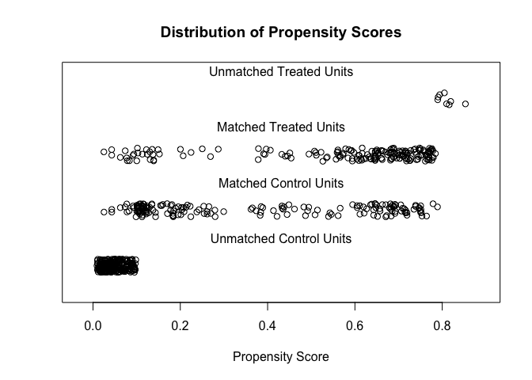

Lalonde
================

## Data io

``` r
data(lalonde)
```

## Lalonde EDA pt. 1

``` r
summary(lalonde)
```

    ##      treat             age             educ           black       
    ##  Min.   :0.0000   Min.   :16.00   Min.   : 0.00   Min.   :0.0000  
    ##  1st Qu.:0.0000   1st Qu.:20.00   1st Qu.: 9.00   1st Qu.:0.0000  
    ##  Median :0.0000   Median :25.00   Median :11.00   Median :0.0000  
    ##  Mean   :0.3013   Mean   :27.36   Mean   :10.27   Mean   :0.3958  
    ##  3rd Qu.:1.0000   3rd Qu.:32.00   3rd Qu.:12.00   3rd Qu.:1.0000  
    ##  Max.   :1.0000   Max.   :55.00   Max.   :18.00   Max.   :1.0000  
    ##      hispan          married          nodegree           re74      
    ##  Min.   :0.0000   Min.   :0.0000   Min.   :0.0000   Min.   :    0  
    ##  1st Qu.:0.0000   1st Qu.:0.0000   1st Qu.:0.0000   1st Qu.:    0  
    ##  Median :0.0000   Median :0.0000   Median :1.0000   Median : 1042  
    ##  Mean   :0.1173   Mean   :0.4153   Mean   :0.6303   Mean   : 4558  
    ##  3rd Qu.:0.0000   3rd Qu.:1.0000   3rd Qu.:1.0000   3rd Qu.: 7888  
    ##  Max.   :1.0000   Max.   :1.0000   Max.   :1.0000   Max.   :35040  
    ##       re75              re78        
    ##  Min.   :    0.0   Min.   :    0.0  
    ##  1st Qu.:    0.0   1st Qu.:  238.3  
    ##  Median :  601.5   Median : 4759.0  
    ##  Mean   : 2184.9   Mean   : 6792.8  
    ##  3rd Qu.: 3249.0   3rd Qu.:10893.6  
    ##  Max.   :25142.2   Max.   :60307.9

``` r
skim(lalonde)
```

<table style='width: auto;'
        class='table table-condensed'>

<caption>

Data summary

</caption>

<thead>

<tr>

<th style="text-align:left;">

</th>

<th style="text-align:left;">

</th>

</tr>

</thead>

<tbody>

<tr>

<td style="text-align:left;">

Name

</td>

<td style="text-align:left;">

lalonde

</td>

</tr>

<tr>

<td style="text-align:left;">

Number of rows

</td>

<td style="text-align:left;">

614

</td>

</tr>

<tr>

<td style="text-align:left;">

Number of columns

</td>

<td style="text-align:left;">

10

</td>

</tr>

<tr>

<td style="text-align:left;">

\_\_\_\_\_\_\_\_\_\_\_\_\_\_\_\_\_\_\_\_\_\_\_

</td>

<td style="text-align:left;">

</td>

</tr>

<tr>

<td style="text-align:left;">

Column type frequency:

</td>

<td style="text-align:left;">

</td>

</tr>

<tr>

<td style="text-align:left;">

numeric

</td>

<td style="text-align:left;">

10

</td>

</tr>

<tr>

<td style="text-align:left;">

\_\_\_\_\_\_\_\_\_\_\_\_\_\_\_\_\_\_\_\_\_\_\_\_

</td>

<td style="text-align:left;">

</td>

</tr>

<tr>

<td style="text-align:left;">

Group variables

</td>

<td style="text-align:left;">

None

</td>

</tr>

</tbody>

</table>

**Variable type: numeric**

<table>

<thead>

<tr>

<th style="text-align:left;">

skim\_variable

</th>

<th style="text-align:right;">

n\_missing

</th>

<th style="text-align:right;">

complete\_rate

</th>

<th style="text-align:right;">

mean

</th>

<th style="text-align:right;">

sd

</th>

<th style="text-align:right;">

p0

</th>

<th style="text-align:right;">

p25

</th>

<th style="text-align:right;">

p50

</th>

<th style="text-align:right;">

p75

</th>

<th style="text-align:right;">

p100

</th>

<th style="text-align:left;">

hist

</th>

</tr>

</thead>

<tbody>

<tr>

<td style="text-align:left;">

treat

</td>

<td style="text-align:right;">

0

</td>

<td style="text-align:right;">

1

</td>

<td style="text-align:right;">

0.30

</td>

<td style="text-align:right;">

0.46

</td>

<td style="text-align:right;">

0

</td>

<td style="text-align:right;">

0.00

</td>

<td style="text-align:right;">

0.00

</td>

<td style="text-align:right;">

1.00

</td>

<td style="text-align:right;">

1.00

</td>

<td style="text-align:left;">

▇▁▁▁▃

</td>

</tr>

<tr>

<td style="text-align:left;">

age

</td>

<td style="text-align:right;">

0

</td>

<td style="text-align:right;">

1

</td>

<td style="text-align:right;">

27.36

</td>

<td style="text-align:right;">

9.88

</td>

<td style="text-align:right;">

16

</td>

<td style="text-align:right;">

20.00

</td>

<td style="text-align:right;">

25.00

</td>

<td style="text-align:right;">

32.00

</td>

<td style="text-align:right;">

55.00

</td>

<td style="text-align:left;">

▇▅▂▂▁

</td>

</tr>

<tr>

<td style="text-align:left;">

educ

</td>

<td style="text-align:right;">

0

</td>

<td style="text-align:right;">

1

</td>

<td style="text-align:right;">

10.27

</td>

<td style="text-align:right;">

2.63

</td>

<td style="text-align:right;">

0

</td>

<td style="text-align:right;">

9.00

</td>

<td style="text-align:right;">

11.00

</td>

<td style="text-align:right;">

12.00

</td>

<td style="text-align:right;">

18.00

</td>

<td style="text-align:left;">

▁▂▆▇▁

</td>

</tr>

<tr>

<td style="text-align:left;">

black

</td>

<td style="text-align:right;">

0

</td>

<td style="text-align:right;">

1

</td>

<td style="text-align:right;">

0.40

</td>

<td style="text-align:right;">

0.49

</td>

<td style="text-align:right;">

0

</td>

<td style="text-align:right;">

0.00

</td>

<td style="text-align:right;">

0.00

</td>

<td style="text-align:right;">

1.00

</td>

<td style="text-align:right;">

1.00

</td>

<td style="text-align:left;">

▇▁▁▁▅

</td>

</tr>

<tr>

<td style="text-align:left;">

hispan

</td>

<td style="text-align:right;">

0

</td>

<td style="text-align:right;">

1

</td>

<td style="text-align:right;">

0.12

</td>

<td style="text-align:right;">

0.32

</td>

<td style="text-align:right;">

0

</td>

<td style="text-align:right;">

0.00

</td>

<td style="text-align:right;">

0.00

</td>

<td style="text-align:right;">

0.00

</td>

<td style="text-align:right;">

1.00

</td>

<td style="text-align:left;">

▇▁▁▁▁

</td>

</tr>

<tr>

<td style="text-align:left;">

married

</td>

<td style="text-align:right;">

0

</td>

<td style="text-align:right;">

1

</td>

<td style="text-align:right;">

0.42

</td>

<td style="text-align:right;">

0.49

</td>

<td style="text-align:right;">

0

</td>

<td style="text-align:right;">

0.00

</td>

<td style="text-align:right;">

0.00

</td>

<td style="text-align:right;">

1.00

</td>

<td style="text-align:right;">

1.00

</td>

<td style="text-align:left;">

▇▁▁▁▆

</td>

</tr>

<tr>

<td style="text-align:left;">

nodegree

</td>

<td style="text-align:right;">

0

</td>

<td style="text-align:right;">

1

</td>

<td style="text-align:right;">

0.63

</td>

<td style="text-align:right;">

0.48

</td>

<td style="text-align:right;">

0

</td>

<td style="text-align:right;">

0.00

</td>

<td style="text-align:right;">

1.00

</td>

<td style="text-align:right;">

1.00

</td>

<td style="text-align:right;">

1.00

</td>

<td style="text-align:left;">

▅▁▁▁▇

</td>

</tr>

<tr>

<td style="text-align:left;">

re74

</td>

<td style="text-align:right;">

0

</td>

<td style="text-align:right;">

1

</td>

<td style="text-align:right;">

4557.55

</td>

<td style="text-align:right;">

6477.96

</td>

<td style="text-align:right;">

0

</td>

<td style="text-align:right;">

0.00

</td>

<td style="text-align:right;">

1042.33

</td>

<td style="text-align:right;">

7888.50

</td>

<td style="text-align:right;">

35040.07

</td>

<td style="text-align:left;">

▇▂▁▁▁

</td>

</tr>

<tr>

<td style="text-align:left;">

re75

</td>

<td style="text-align:right;">

0

</td>

<td style="text-align:right;">

1

</td>

<td style="text-align:right;">

2184.94

</td>

<td style="text-align:right;">

3295.68

</td>

<td style="text-align:right;">

0

</td>

<td style="text-align:right;">

0.00

</td>

<td style="text-align:right;">

601.55

</td>

<td style="text-align:right;">

3248.99

</td>

<td style="text-align:right;">

25142.24

</td>

<td style="text-align:left;">

▇▁▁▁▁

</td>

</tr>

<tr>

<td style="text-align:left;">

re78

</td>

<td style="text-align:right;">

0

</td>

<td style="text-align:right;">

1

</td>

<td style="text-align:right;">

6792.83

</td>

<td style="text-align:right;">

7470.73

</td>

<td style="text-align:right;">

0

</td>

<td style="text-align:right;">

238.28

</td>

<td style="text-align:right;">

4759.02

</td>

<td style="text-align:right;">

10893.59

</td>

<td style="text-align:right;">

60307.93

</td>

<td style="text-align:left;">

▇▂▁▁▁

</td>

</tr>

</tbody>

</table>

``` r
df_status(lalonde)
```

    ##    variable q_zeros p_zeros q_na p_na q_inf p_inf    type unique
    ## 1     treat     429   69.87    0    0     0     0 integer      2
    ## 2       age       0    0.00    0    0     0     0 integer     40
    ## 3      educ       3    0.49    0    0     0     0 integer     19
    ## 4     black     371   60.42    0    0     0     0 integer      2
    ## 5    hispan     542   88.27    0    0     0     0 integer      2
    ## 6   married     359   58.47    0    0     0     0 integer      2
    ## 7  nodegree     227   36.97    0    0     0     0 integer      2
    ## 8      re74     243   39.58    0    0     0     0 numeric    358
    ## 9      re75     245   39.90    0    0     0     0 numeric    356
    ## 10     re78     143   23.29    0    0     0     0 numeric    457

## Lalonde EDA, pt. 2

``` r
lalonde %>% 
  group_by(treat) %>% 
  count(sort = TRUE, wt = age, name = "subjects")
```

    ## # A tibble: 2 x 2
    ## # Groups:   treat [2]
    ##   treat subjects
    ##   <int>    <int>
    ## 1     0    12025
    ## 2     1     4776

``` r
lalonde %>% 
  group_by(treat) %>% 
  count(decile = 10 * (age %/% 10))
```

    ## # A tibble: 9 x 3
    ## # Groups:   treat [2]
    ##   treat decile     n
    ##   <int>  <dbl> <int>
    ## 1     0     10   115
    ## 2     0     20   166
    ## 3     0     30    71
    ## 4     0     40    51
    ## 5     0     50    26
    ## 6     1     10    38
    ## 7     1     20   108
    ## 8     1     30    24
    ## 9     1     40    15

## Lalonde EDA, pt. 3

``` r
summary(lalonde$re78)
```

    ##    Min. 1st Qu.  Median    Mean 3rd Qu.    Max. 
    ##     0.0   238.3  4759.0  6792.8 10893.6 60307.9

``` r
describe(lalonde$re78)
```

    ## lalonde$re78 
    ##        n  missing distinct     Info     Mean      Gmd      .05      .10 
    ##      614        0      457    0.987     6793     7807      0.0      0.0 
    ##      .25      .50      .75      .90      .95 
    ##    238.3   4759.0  10893.6  17800.1  21691.8 
    ## 
    ## lowest :     0.00000    31.03226    33.98771    54.67588    94.57450
    ## highest: 26372.28000 26817.60000 34099.28000 36646.95000 60307.93000

``` r
hist(lalonde$re78, )
```

<!-- -->

``` r
hist(log(lalonde$re78))
```

<!-- -->

``` r
ggplot(lalonde, aes(x=age)) + 
  geom_histogram(binwidth=2,colour="white",fill="skyblue") +
  facet_grid(. ~ treat)
```

<!-- -->

## Distribution Fitting

``` r
hist(rgamma(100,2,11))
```

<!-- -->

``` r
hist(rnorm(100,5,.01))
```

<!-- -->

``` r
x <- rgamma(10000,2,11) + rnorm(10000,5,.01)
fit.gamma <- fitdist(x, distr = "gamma", method = "mle")
summary(fit.gamma)
```

    ## Fitting of the distribution ' gamma ' by maximum likelihood 
    ## Parameters : 
    ##        estimate Std. Error
    ## shape 1672.6215  23.652321
    ## rate   322.8423   4.565953
    ## Loglikelihood:  6473.97   AIC:  -12943.94   BIC:  -12929.52 
    ## Correlation matrix:
    ##           shape      rate
    ## shape 1.0000000 0.9998505
    ## rate  0.9998505 1.0000000

``` r
plot(fit.gamma)
```

<!-- -->

``` r
# lalonde_gamma <- fitdist(lalonde$re78 + 1, distr = "gamma", method = "mle")
# summary(lalonde_gamma)
# plot(lalonde_gamma)
```

## Matching

#### Nearest neighbor 1:1 match

``` r
match_1 <- matchit(formula = treat ~ age + educ + black + hispan + married + 
                   nodegree + re74 + re75, 
        method = "nearest",
        data = lalonde,
        discard = "both", 
        replace = FALSE, 
        #caliper = c(),
        #std.caliper = c(),
        ratio = 1)

match_1
```

    ## A matchit object
    ##  - method: 1:1 nearest neighbor matching without replacement
    ##  - distance: Propensity score [common support]
    ##              - estimated with logistic regression
    ##  - common support: units from both groups dropped
    ##  - number of obs.: 614 (original), 354 (matched)
    ##  - target estimand: ATT
    ##  - covariates: age, educ, black, hispan, married, nodegree, re74, re75

``` r
summary(match_1, subclass = TRUE, un = FALSE)
```

    ## 
    ## Call:
    ## matchit(formula = treat ~ age + educ + black + hispan + married + 
    ##     nodegree + re74 + re75, data = lalonde, method = "nearest", 
    ##     discard = "both", replace = FALSE, ratio = 1)
    ## 
    ## Summary of Balance for Matched Data:
    ##          Means Treated Means Control Std. Mean Diff. Var. Ratio eCDF Mean
    ## distance        0.5669        0.3750          0.8715     0.7562    0.1139
    ## age            25.4463       25.2316          0.0300     0.4336    0.0870
    ## educ           10.3220       10.5876         -0.1321     0.6076    0.0235
    ## black           0.8362        0.4915          0.9479          .    0.3446
    ## hispan          0.0621        0.2203         -0.6689          .    0.1582
    ## married         0.1977        0.2090         -0.0289          .    0.0113
    ## nodegree        0.6949        0.6384          0.1243          .    0.0565
    ## re74         2179.3904     2348.2864         -0.0346     1.3547    0.0423
    ## re75         1485.9177     1612.6659         -0.0394     1.4896    0.0491
    ##          eCDF Max Std. Pair Dist.
    ## distance   0.3955          0.8718
    ## age        0.2486          1.4087
    ## educ       0.0678          1.2392
    ## black      0.3446          0.9479
    ## hispan     0.1582          1.0512
    ## married    0.0113          0.8655
    ## nodegree   0.0565          0.8450
    ## re74       0.2542          0.7408
    ## re75       0.2034          0.7366
    ## 
    ## Sample Sizes:
    ##           Control Treated
    ## All           429     185
    ## Matched       177     177
    ## Unmatched     195       0
    ## Discarded      57       8

#### Match diagnostics

``` r
plot(summary(match_1))
```

<!-- -->

``` r
love.plot(bal.tab(match_1), stars = "std")
```

<!-- -->

``` r
# Examining distributional balance with plots:
bal.plot(match_1, var.name = "nodegree")
```

<!-- -->

``` r
bal.plot(match_1, var.name = "distance", mirror = TRUE, type = "histogram")
```

<!-- -->

``` r
plot(match_1, type = "jitter", interactive = FALSE)
```

<!-- -->

``` r
plot(match_1, type = "qq", interactive = FALSE,
     which.xs = c("age", "married", "re75"))
```

<!-- -->

``` r
#eCDF plot
plot(match_1, type = "ecdf", which.xs = c("educ", "married", "re75"))
```

<!-- -->

## Matched data

``` r
match_1_data <- match.data(match_1)

head(match_1_data)
```

    ##   treat age educ black hispan married nodegree re74 re75       re78  distance
    ## 1     1  37   11     1      0       1        1    0    0  9930.0460 0.6387699
    ## 2     1  22    9     0      1       0        1    0    0  3595.8940 0.2246342
    ## 3     1  30   12     1      0       0        0    0    0 24909.4500 0.6782439
    ## 4     1  27   11     1      0       0        1    0    0  7506.1460 0.7763241
    ## 5     1  33    8     1      0       0        1    0    0   289.7899 0.7016387
    ## 6     1  22    9     1      0       0        1    0    0  4056.4940 0.6990699
    ##   weights subclass
    ## 1       1        1
    ## 2       1       94
    ## 3       1      105
    ## 4       1      116
    ## 5       1      127
    ## 6       1      138

#### Full matching (match 2)

From MatchIt reference:

Given the poor performance of nearest neighbor matching in this example,
we can try a different matching method or make other changes to the
matching algorithm or distance specification. Below, we’ll try full
matching, which matches every treated unit to at least one control and
every control to at least one treated unit (Hansen 2004; Stuart and
Green 2008). We’ll also try a different link (probit) for the propensity
score model.

``` r
match_2 <- matchit(formula = treat ~ age + educ + black + hispan + married + 
                   nodegree + re74 + re75, 
        method = "full",
        distance = "glm",
        link = "probit",
        data = lalonde,
        discard = "both"
        #replace = FALSE, 
        #caliper = c(),
        #std.caliper = c(),
        #ratio = 1
        )

match_2
```

    ## A matchit object
    ##  - method: Optimal full matching
    ##  - distance: Propensity score [common support]
    ##              - estimated with probit regression
    ##  - common support: units from both groups dropped
    ##  - number of obs.: 614 (original), 546 (matched)
    ##  - target estimand: ATT
    ##  - covariates: age, educ, black, hispan, married, nodegree, re74, re75

``` r
summary(match_2, subclass = TRUE, un = FALSE)
```

    ## 
    ## Call:
    ## matchit(formula = treat ~ age + educ + black + hispan + married + 
    ##     nodegree + re74 + re75, data = lalonde, method = "full", 
    ##     distance = "glm", link = "probit", discard = "both")
    ## 
    ## Summary of Balance for Matched Data:
    ##          Means Treated Means Control Std. Mean Diff. Var. Ratio eCDF Mean
    ## distance        0.5672        0.5673         -0.0003     0.9899    0.0040
    ## age            25.4463       25.8881         -0.0617     0.4301    0.0890
    ## educ           10.3220       10.3354         -0.0066     0.6197    0.0199
    ## black           0.8362        0.8316          0.0124          .    0.0045
    ## hispan          0.0621        0.0515          0.0449          .    0.0106
    ## married         0.1977        0.1647          0.0844          .    0.0331
    ## nodegree        0.6949        0.6784          0.0364          .    0.0166
    ## re74         2179.3904     2167.2675          0.0025     1.4077    0.0360
    ## re75         1485.9177     1461.8476          0.0075     1.5382    0.0405
    ##          eCDF Max Std. Pair Dist.
    ## distance   0.0565          0.0166
    ## age        0.2547          1.2411
    ## educ       0.0625          1.2022
    ## black      0.0045          0.0187
    ## hispan     0.0106          0.5753
    ## married    0.0331          0.5732
    ## nodegree   0.0166          0.9975
    ## re74       0.2331          0.7737
    ## re75       0.1848          0.8010
    ## 
    ## Sample Sizes:
    ##               Control Treated
    ## All            429.       185
    ## Matched (ESS)   60.69     177
    ## Matched        369.       177
    ## Unmatched        0.         0
    ## Discarded       60.         8

#### Match diagnostics (match 2)

``` r
summary(match_2)
```

    ## 
    ## Call:
    ## matchit(formula = treat ~ age + educ + black + hispan + married + 
    ##     nodegree + re74 + re75, data = lalonde, method = "full", 
    ##     distance = "glm", link = "probit", discard = "both")
    ## 
    ## Summary of Balance for All Data:
    ##          Means Treated Means Control Std. Mean Diff. Var. Ratio eCDF Mean
    ## distance        0.5773        0.1817          1.8276     0.8777    0.3774
    ## age            25.8162       28.0303         -0.3094     0.4400    0.0813
    ## educ           10.3459       10.2354          0.0550     0.4959    0.0347
    ## black           0.8432        0.2028          1.7615          .    0.6404
    ## hispan          0.0595        0.1422         -0.3498          .    0.0827
    ## married         0.1892        0.5128         -0.8263          .    0.3236
    ## nodegree        0.7081        0.5967          0.2450          .    0.1114
    ## re74         2095.5737     5619.2365         -0.7211     0.5181    0.2248
    ## re75         1532.0553     2466.4844         -0.2903     0.9563    0.1342
    ##          eCDF Max
    ## distance   0.6413
    ## age        0.1577
    ## educ       0.1114
    ## black      0.6404
    ## hispan     0.0827
    ## married    0.3236
    ## nodegree   0.1114
    ## re74       0.4470
    ## re75       0.2876
    ## 
    ## 
    ## Summary of Balance for Matched Data:
    ##          Means Treated Means Control Std. Mean Diff. Var. Ratio eCDF Mean
    ## distance        0.5672        0.5673         -0.0003     0.9899    0.0040
    ## age            25.4463       25.8881         -0.0617     0.4301    0.0890
    ## educ           10.3220       10.3354         -0.0066     0.6197    0.0199
    ## black           0.8362        0.8316          0.0124          .    0.0045
    ## hispan          0.0621        0.0515          0.0449          .    0.0106
    ## married         0.1977        0.1647          0.0844          .    0.0331
    ## nodegree        0.6949        0.6784          0.0364          .    0.0166
    ## re74         2179.3904     2167.2675          0.0025     1.4077    0.0360
    ## re75         1485.9177     1461.8476          0.0075     1.5382    0.0405
    ##          eCDF Max Std. Pair Dist.
    ## distance   0.0565          0.0166
    ## age        0.2547          1.2411
    ## educ       0.0625          1.2022
    ## black      0.0045          0.0187
    ## hispan     0.0106          0.5753
    ## married    0.0331          0.5732
    ## nodegree   0.0166          0.9975
    ## re74       0.2331          0.7737
    ## re75       0.1848          0.8010
    ## 
    ## Percent Balance Improvement:
    ##          Std. Mean Diff. Var. Ratio eCDF Mean eCDF Max
    ## distance           100.0       92.2      99.0     91.2
    ## age                 80.0       -2.8      -9.5    -61.5
    ## educ                87.9       31.8      42.8     43.9
    ## black               99.3          .      99.3     99.3
    ## hispan              87.2          .      87.2     87.2
    ## married             89.8          .      89.8     89.8
    ## nodegree            85.1          .      85.1     85.1
    ## re74                99.7       48.0      84.0     47.8
    ## re75                97.4     -863.5      69.8     35.8
    ## 
    ## Sample Sizes:
    ##               Control Treated
    ## All            429.       185
    ## Matched (ESS)   60.69     177
    ## Matched        369.       177
    ## Unmatched        0.         0
    ## Discarded       60.         8

``` r
plot(summary(match_2))
```

<!-- -->

``` r
love.plot(bal.tab(match_2), stars = "std")
```

<!-- -->

``` r
# Examining distributional balance with plots:
bal.plot(match_2, var.name = "nodegree")
```

<!-- -->

``` r
bal.plot(match_2, var.name = "distance", mirror = TRUE, type = "histogram")
```

<!-- -->

``` r
plot(match_2, type = "jitter", interactive = FALSE)
```

<!-- -->

``` r
plot(match_2, type = "qq", interactive = FALSE,
     which.xs = c("age", "married", "re75"))
```

<!-- -->

``` r
#eCDF plot
plot(match_2, type = "ecdf", which.xs = c("educ", "married", "re75"))
```

<!-- -->

#### Matched data (match 2)

``` r
match_2_data <- match.data(match_2)
```

## Estimating the Treatment Effect

<https://kosukeimai.github.io/MatchIt/articles/MatchIt.html>

How treatment effects are estimated depends on what form of matching was
performed. See vignette(“estimating-effects”) for information on the
variety of way to estimate effects and standard errors after each type
of matching and for several outcome types. After 1:1 matching without
replacement (i.e., the first matching specification above), we can run a
simple regression of the outcome on the treatment in the matched sample
(i.e., including the matching weights). With continuous outcomes, it is
often a good idea to also include the covariates used in the matching in
the effect estimation, as doing so can provide additional robustness to
slight imbalances remaining after the matching and can improve
precision.

Even though the 1:1 matching was not successful, we’ll demonstrate here
how to estimate a treatment effect after performing such an analysis.
First, we’ll extract the matched dataset from the matchit object using
match.data(). This dataset only contains the matched units and adds
columns for distance, weights, and subclass (described previously).

We can then estimate a treatment effect in this dataset using the
standard regression functions in R, like lm() or glm(), being sure to
include the matching weights (stored in the weights variable of the
match.data() output) in the estimation3. We recommend using
cluster-robust standard errors for most analyses, with pair membership
as the clustering variable; the lmtest and sandwich packages together
make this straightforward.

Although there are many possible ways to include covariates (i.e., not
just main effects but interactions, smoothing terms like splines, or
other nonlinear transformations), it is important not to engage in
specification search (i.e., trying many outcomes models in search of the
“best” one). Doing so can invalidate results and yield a conclusion that
fails to replicate. For this reason, we recommend only including the
same terms included in the propensity score model unless there is a
strong a priori and justifiable reason to model the outcome differently.
Second, it is important not to interpret the coefficients and tests of
the other covariates in the outcome model. These are not causal effects
and their estimates may be severely confounded. Only the treatment
effect estimate can be interpreted as causal assuming the relevant
assumptions about unconfoundedness are met. **Inappropriately
interpreting the coefficients of covariates in the outcome model is
known as the Table 2 fallacy** (Westreich and Greenland 2013). To avoid
this, in all examples that incorporate covariates in the outcome model,
we restrict the output of outcome regression models to just the
treatment coefficient.

#### Linear Modeling

#### Assumptions:

  - Linearity
  - Homoscedasticity
  - Independence
  - Normality

<http://www.sthda.com/english/articles/39-regression-model-diagnostics/161-linear-regression-assumptions-and-diagnostics-in-r-essentials/>

<https://data.library.virginia.edu/diagnostic-plots/>

#### Pre-match data model

``` r
plot(lalonde$re78)
```

<!-- -->

``` r
# Pre-match data:
prematch_lm <- lm(re78 ~ treat, data = lalonde)

autoplot(prematch_lm) +
  theme_abyss()
```

    ## Warning: `arrange_()` is deprecated as of dplyr 0.7.0.
    ## Please use `arrange()` instead.
    ## See vignette('programming') for more help
    ## This warning is displayed once every 8 hours.
    ## Call `lifecycle::last_warnings()` to see where this warning was generated.

<!-- -->

``` r
  #theme_minimal() + 
  #theme_ft_rc()
```

#### Model 1 sandwich

``` r
fit1 <- lm(re78 ~ treat + age + educ + black + hispan + married + nodegree + 
             re74 + re75, 
           data = match_1_data, 
           weights = weights)

coeftest(fit1, vcov. = vcovCL, cluster = ~subclass)
```

    ## 
    ## t test of coefficients:
    ## 
    ##                Estimate  Std. Error t value Pr(>|t|)  
    ## (Intercept)  888.366052 3130.466960  0.2838  0.77675  
    ## treat       1116.038833  709.421069  1.5732  0.11660  
    ## age           -8.373257   41.839702 -0.2001  0.84150  
    ## educ         426.186450  193.915458  2.1978  0.02863 *
    ## black       -917.343709  947.193306 -0.9685  0.33348  
    ## hispan       762.385292 1197.871812  0.6364  0.52491  
    ## married     -129.340891  925.027275 -0.1398  0.88888  
    ## nodegree     273.837364 1068.170639  0.2564  0.79783  
    ## re74           0.034354    0.168952  0.2033  0.83899  
    ## re75           0.250141    0.161806  1.5459  0.12304  
    ## ---
    ## Signif. codes:  0 '***' 0.001 '**' 0.01 '*' 0.05 '.' 0.1 ' ' 1

#### Model 2 sandwich

``` r
fit2 <- lm(re78 ~ treat + age + educ + black + hispan + married + nodegree + 
             re74 + re75, 
           data = match_2_data, 
           weights = weights)

coeftest(fit2, vcov. = vcovCL, cluster = ~subclass)
```

    ## 
    ## t test of coefficients:
    ## 
    ##                Estimate  Std. Error t value Pr(>|t|)    
    ## (Intercept)  5.3888e+03  3.1426e+03  1.7148 0.086968 .  
    ## treat        1.7267e+03  7.3585e+02  2.3465 0.019314 *  
    ## age         -5.2315e+01  3.6836e+01 -1.4202 0.156130    
    ## educ         1.7486e+02  1.9848e+02  0.8810 0.378710    
    ## black       -1.5640e+03  7.9872e+02 -1.9582 0.050729 .  
    ## hispan      -4.6242e+02  1.5337e+03 -0.3015 0.763145    
    ## married      1.0156e+03  1.1631e+03  0.8732 0.382971    
    ## nodegree    -1.6401e+03  1.2653e+03 -1.2962 0.195478    
    ## re74        -1.5587e-02  1.5121e-01 -0.1031 0.917939    
    ## re75         5.3991e-01  1.5017e-01  3.5953 0.000354 ***
    ## ---
    ## Signif. codes:  0 '***' 0.001 '**' 0.01 '*' 0.05 '.' 0.1 ' ' 1

Note that the “treat” coefficient in the linear regression model for the
first match is not statistically significant, but it is in the linear
regression model for the second match.

## Uncertainty / confidence intervals

#### Match 1 bootstrap

<https://kosukeimai.github.io/MatchIt/articles/estimating-effects.html#after-pair-matching-with-replacement-1>

``` r
#Block bootstrap confidence interval
# library(boot)

pair_ids <- levels(match_1_data$subclass)

est_fun <- function(pairs, i) {
  
  #Compute number of times each pair is present
  numreps <- table(pairs[i])
  
  #For each pair p, copy corresponding md row indices numreps[p] times
  ids <- unlist(lapply(pair_ids[pair_ids %in% names(numreps)],
                       function(p) rep(which(match_1_data$subclass == p), 
                                              numreps[p])))
  
  #Subset md with block bootstrapped ids
  md_boot <- match_1_data[ids,]
  
  #Effect estimation
  fit_boot <- lm(re78 ~ treat + age + educ + black + hispan + married + nodegree + 
             re74 + re75,
                 data = md_boot,
                 weights = weights)
  
  #Return the coefficient on treatment
  return(coef(fit_boot)["treat"])
}

boot_est <- boot(pair_ids, est_fun, R = 999)
boot_est
```

    ## 
    ## ORDINARY NONPARAMETRIC BOOTSTRAP
    ## 
    ## 
    ## Call:
    ## boot(data = pair_ids, statistic = est_fun, R = 999)
    ## 
    ## 
    ## Bootstrap Statistics :
    ##     original    bias    std. error
    ## t1* 1116.039 -20.16308    710.1202

``` r
boot.ci(boot_est, type = "bca")
```

    ## BOOTSTRAP CONFIDENCE INTERVAL CALCULATIONS
    ## Based on 999 bootstrap replicates
    ## 
    ## CALL : 
    ## boot.ci(boot.out = boot_est, type = "bca")
    ## 
    ## Intervals : 
    ## Level       BCa          
    ## 95%   (-285, 2482 )  
    ## Calculations and Intervals on Original Scale

#### Match 2 bootstrap

<https://moderndive.com/10-inference-for-regression.html> is another
helpful resource in addition to the above link from Kosuke Imai

``` r
#Block bootstrap confidence interval
# library(boot)

pair_ids <- levels(match_2_data$subclass)

est_fun <- function(pairs, i) {
  
  #Compute number of times each pair is present
  numreps <- table(pairs[i])
  
  #For each pair p, copy corresponding md row indices numreps[p] times
  ids <- unlist(lapply(pair_ids[pair_ids %in% names(numreps)],
                       function(p) rep(which(match_2_data$subclass == p), 
                                              numreps[p])))
  
  #Subset md with block bootstrapped ids
  md_boot <- match_1_data[ids,]
  
  #Effect estimation
  fit_boot <- lm(re78 ~ treat + age + educ + black + hispan + married + nodegree +
                   re74 + re75,
                 data = md_boot,
                 weights = weights)
  
  #Return the coefficient on treatment
  return(coef(fit_boot)["treat"])
}

boot_est <- boot(pair_ids, est_fun, R = 999)
boot_est
```

    ## 
    ## ORDINARY NONPARAMETRIC BOOTSTRAP
    ## 
    ## 
    ## Call:
    ## boot(data = pair_ids, statistic = est_fun, R = 999)
    ## 
    ## 
    ## Bootstrap Statistics :
    ##     original    bias    std. error
    ## t1* 1116.039 -76.97125    727.0259

``` r
boot.ci(boot_est, type = "bca")
```

    ## BOOTSTRAP CONFIDENCE INTERVAL CALCULATIONS
    ## Based on 999 bootstrap replicates
    ## 
    ## CALL : 
    ## boot.ci(boot.out = boot_est, type = "bca")
    ## 
    ## Intervals : 
    ## Level       BCa          
    ## 95%   (-224, 2614 )  
    ## Calculations and Intervals on Original Scale

## Generalized Linear Modeling

  - Get help page:
  - ?family

See <https://fromthebottomoftheheap.net/2016/06/07/rootograms/>

``` r
# Gaussian-distributed residuals and identity link = OLS:
gaussian_identity <- glm(re78 ~ treat + age + educ + black + hispan + married + nodegree + re74 + re75, 
                         data = match_2_data, 
                         family = gaussian(link = "identity"),
                         weights = weights)
summary(gaussian_identity)
```

    ## 
    ## Call:
    ## glm(formula = re78 ~ treat + age + educ + black + hispan + married + 
    ##     nodegree + re74 + re75, family = gaussian(link = "identity"), 
    ##     data = match_2_data, weights = weights)
    ## 
    ## Deviance Residuals: 
    ##    Min      1Q  Median      3Q     Max  
    ## -15809   -2724    -855    2249   33145  
    ## 
    ## Coefficients:
    ##               Estimate Std. Error t value Pr(>|t|)    
    ## (Intercept)  5.389e+03  2.220e+03   2.428  0.01552 *  
    ## treat        1.727e+03  5.236e+02   3.298  0.00104 ** 
    ## age         -5.231e+01  2.810e+01  -1.862  0.06318 .  
    ## educ         1.749e+02  1.398e+02   1.251  0.21151    
    ## black       -1.564e+03  7.893e+02  -1.982  0.04803 *  
    ## hispan      -4.624e+02  1.290e+03  -0.359  0.72004    
    ## married      1.016e+03  7.141e+02   1.422  0.15558    
    ## nodegree    -1.640e+03  7.204e+02  -2.277  0.02320 *  
    ## re74        -1.559e-02  7.060e-02  -0.221  0.82536    
    ## re75         5.399e-01  1.101e-01   4.903 1.25e-06 ***
    ## ---
    ## Signif. codes:  0 '***' 0.001 '**' 0.01 '*' 0.05 '.' 0.1 ' ' 1
    ## 
    ## (Dispersion parameter for gaussian family taken to be 32654842)
    ## 
    ##     Null deviance: 2.0468e+10  on 545  degrees of freedom
    ## Residual deviance: 1.7503e+10  on 536  degrees of freedom
    ## AIC: 11506
    ## 
    ## Number of Fisher Scoring iterations: 2

``` r
# Gamma default link is "inverse"
gamma_inverse <- glm(re78 + 1 ~ treat + age + educ + black + hispan + married + nodegree + re74 + re75, data = match_2_data, family = Gamma(link = "inverse"))
summary(gamma_inverse)
```

    ## 
    ## Call:
    ## glm(formula = re78 + 1 ~ treat + age + educ + black + hispan + 
    ##     married + nodegree + re74 + re75, family = Gamma(link = "inverse"), 
    ##     data = match_2_data)
    ## 
    ## Deviance Residuals: 
    ##     Min       1Q   Median       3Q      Max  
    ## -4.0995  -2.4516  -0.4159   0.5069   2.5705  
    ## 
    ## Coefficients:
    ##               Estimate Std. Error t value Pr(>|t|)    
    ## (Intercept)  2.904e-04  7.166e-05   4.053 5.81e-05 ***
    ## treat       -2.884e-05  2.023e-05  -1.425  0.15463    
    ## age          4.245e-07  9.550e-07   0.444  0.65687    
    ## educ        -9.793e-06  4.833e-06  -2.026  0.04324 *  
    ## black        3.356e-05  2.132e-05   1.574  0.11597    
    ## hispan      -2.662e-05  2.182e-05  -1.220  0.22300    
    ## married     -5.468e-06  1.836e-05  -0.298  0.76597    
    ## nodegree    -8.993e-06  2.306e-05  -0.390  0.69671    
    ## re74        -1.902e-09  1.210e-09  -1.571  0.11671    
    ## re75        -5.225e-09  1.646e-09  -3.175  0.00158 ** 
    ## ---
    ## Signif. codes:  0 '***' 0.001 '**' 0.01 '*' 0.05 '.' 0.1 ' ' 1
    ## 
    ## (Dispersion parameter for Gamma family taken to be 1.213309)
    ## 
    ##     Null deviance: 2478.0  on 545  degrees of freedom
    ## Residual deviance: 2437.7  on 536  degrees of freedom
    ## AIC: 9730.9
    ## 
    ## Number of Fisher Scoring iterations: 7

``` r
# Using log link
# gamma_log <- glm(re78 + 1 ~ treat + age + educ + black + hispan + married + nodegree + re74 + re75, data = match_2_data, family=Gamma(link = "log"))
# summary(gamma_log)

# # Fixing error from above due to inf values:
# match_2_data_new <- match_2_data # Duplicate data
# match_2_data_new[is.na(match_2_data_new) | match_2_data_new == "Inf"] <- NA  # Replace NaN & Inf with NA
# 
# # Add in positive constant:
# match_2_data_new$re78 <- match_2_data_new$re78 + 1
# 
# gamma_log <- glm(re78 ~ treat + age + educ + black + hispan + married + nodegree + re74 + re75, 
#                  data = match_2_data_new, 
#                  family = Gamma(link = "log"),
#                  weights = weights)
# summary(gamma_log)


# plot(rstudent(gamma_log))
# plot(influence(gamma_log)$hat)
# plot(cooks.distance(gamma_log))
```
