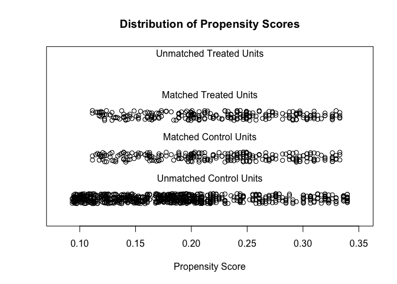
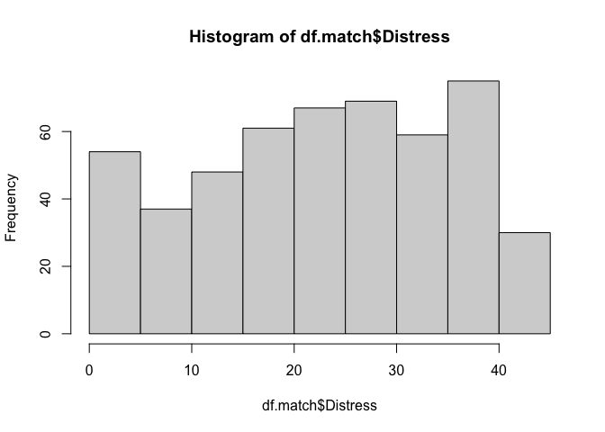

Wakefield
================

## Using data synthesized via the wakefield package by Tyler Rinker to demonstrate propensity score matching

<https://www.r-bloggers.com/2016/06/how-to-use-r-for-matching-samples-propensity-score/>

## Synthesize

``` r
set.seed(1234)
df.patients <- r_data_frame(n = 250, 
                            age(x = 30:78, 
                                name = 'Age'), 
                            sex(x = c("Male", "Female"), 
                                prob = c(0.70, 0.30), 
                                name = "Sex"))
df.patients$Sample <- as.factor('Patients')

summary(df.patients)
```

    ##       Age            Sex           Sample   
    ##  Min.   :30.00   Male  :163   Patients:250  
    ##  1st Qu.:42.00   Female: 87                 
    ##  Median :52.00                              
    ##  Mean   :53.51                              
    ##  3rd Qu.:65.00                              
    ##  Max.   :78.00

``` r
set.seed(1234)
df.population <- r_data_frame(n = 1000, 
                              age(x = 18:80, 
                                  name = 'Age'), 
                              sex(x = c("Male", "Female"), 
                                  prob = c(0.50, 0.50), 
                                  name = "Sex"))
df.population$Sample <- as.factor('Population')

summary(df.population)
```

    ##       Age            Sex             Sample    
    ##  Min.   :18.00   Male  :487   Population:1000  
    ##  1st Qu.:34.00   Female:513                    
    ##  Median :49.00                                 
    ##  Mean   :49.06                                 
    ##  3rd Qu.:64.00                                 
    ##  Max.   :80.00

## Merge synthetic dataframes

``` r
mydata <- rbind(df.patients, df.population)
mydata$Group <- as.logical(mydata$Sample == 'Patients')
mydata$Distress <- ifelse(mydata$Sex == 'Male', age(nrow(mydata), x = 0:42, name = 'Distress'),
                                                age(nrow(mydata), x = 15:42, name = 'Distress'))
```

## Compare distributions

``` r
table1 <- CreateTableOne(vars = c('Age', 'Sex', 'Distress'), 
                         data = mydata, 
                         factorVars = 'Sex', 
                         strata = 'Sample')
table1 <- print(table1, 
                printToggle = FALSE, 
                noSpaces = TRUE)
kable(table1[,1:3],  
      align = 'c', 
      caption = 'Table 1: Comparison of unmatched samples')
```

<table>

<caption>

Table 1: Comparison of unmatched samples

</caption>

<thead>

<tr>

<th style="text-align:left;">

</th>

<th style="text-align:center;">

Patients

</th>

<th style="text-align:center;">

Population

</th>

<th style="text-align:center;">

p

</th>

</tr>

</thead>

<tbody>

<tr>

<td style="text-align:left;">

n

</td>

<td style="text-align:center;">

250

</td>

<td style="text-align:center;">

1000

</td>

<td style="text-align:center;">

</td>

</tr>

<tr>

<td style="text-align:left;">

Age (mean (SD))

</td>

<td style="text-align:center;">

53.51 (13.86)

</td>

<td style="text-align:center;">

49.06 (17.77)

</td>

<td style="text-align:center;">

NA

</td>

</tr>

<tr>

<td style="text-align:left;">

Sex = Female (%)

</td>

<td style="text-align:center;">

87 (34.8)

</td>

<td style="text-align:center;">

513 (51.3)

</td>

<td style="text-align:center;">

\<0.001

</td>

</tr>

<tr>

<td style="text-align:left;">

Distress (mean (SD))

</td>

<td style="text-align:center;">

23.53 (11.94)

</td>

<td style="text-align:center;">

25.44 (10.97)

</td>

<td style="text-align:center;">

NA

</td>

</tr>

</tbody>

</table>

## Matching

``` r
set.seed(1234)
match.it <- matchit(Group ~ Age + Sex, 
                    data = mydata, 
                    method="nearest",
                    discard = "both", 
                    replace = FALSE,
                    ratio=1)

a <- summary(match.it)

kable(a$nn, digits = 2, align = 'c', 
      caption = 'Table 2: Sample sizes')
```

<table>

<caption>

Table 2: Sample sizes

</caption>

<thead>

<tr>

<th style="text-align:left;">

</th>

<th style="text-align:center;">

Control

</th>

<th style="text-align:center;">

Treated

</th>

</tr>

</thead>

<tbody>

<tr>

<td style="text-align:left;">

All (ESS)

</td>

<td style="text-align:center;">

1000

</td>

<td style="text-align:center;">

250

</td>

</tr>

<tr>

<td style="text-align:left;">

All

</td>

<td style="text-align:center;">

1000

</td>

<td style="text-align:center;">

250

</td>

</tr>

<tr>

<td style="text-align:left;">

Matched (ESS)

</td>

<td style="text-align:center;">

250

</td>

<td style="text-align:center;">

250

</td>

</tr>

<tr>

<td style="text-align:left;">

Matched

</td>

<td style="text-align:center;">

250

</td>

<td style="text-align:center;">

250

</td>

</tr>

<tr>

<td style="text-align:left;">

Unmatched

</td>

<td style="text-align:center;">

625

</td>

<td style="text-align:center;">

0

</td>

</tr>

<tr>

<td style="text-align:left;">

Discarded

</td>

<td style="text-align:center;">

125

</td>

<td style="text-align:center;">

0

</td>

</tr>

</tbody>

</table>

``` r
kable(a$sum.matched[c(1,2,4)], digits = 2, align = 'c', 
      caption = 'Table 3: Summary of balance for matched data')
```

<table>

<caption>

Table 3: Summary of balance for matched data

</caption>

<thead>

<tr>

<th style="text-align:center;">

x

</th>

</tr>

</thead>

<tbody>

<tr>

<td style="text-align:center;">

0.22

</td>

</tr>

<tr>

<td style="text-align:center;">

53.51

</td>

</tr>

<tr>

<td style="text-align:center;">

0.35

</td>

</tr>

</tbody>

</table>

``` r
plot(match.it, type = 'jitter', interactive = FALSE)
```

<!-- -->

## Post match analysis

``` r
df.match <- match.data(match.it)[1:ncol(mydata)]
rm(df.patients, df.population)

table4 <- CreateTableOne(vars = c('Age', 'Sex', 'Distress'), 
                         data = df.match, 
                         factorVars = 'Sex', 
                         strata = 'Sample')
table4 <- print(table4, 
                printToggle = FALSE, 
                noSpaces = TRUE)
kable(table4[,1:3],  
      align = 'c', 
      caption = 'Table 4: Comparison of matched samples')
```

<table>

<caption>

Table 4: Comparison of matched samples

</caption>

<thead>

<tr>

<th style="text-align:left;">

</th>

<th style="text-align:center;">

Patients

</th>

<th style="text-align:center;">

Population

</th>

<th style="text-align:center;">

p

</th>

</tr>

</thead>

<tbody>

<tr>

<td style="text-align:left;">

n

</td>

<td style="text-align:center;">

250

</td>

<td style="text-align:center;">

250

</td>

<td style="text-align:center;">

</td>

</tr>

<tr>

<td style="text-align:left;">

Age (mean (SD))

</td>

<td style="text-align:center;">

53.51 (13.86)

</td>

<td style="text-align:center;">

53.47 (13.85)

</td>

<td style="text-align:center;">

NA

</td>

</tr>

<tr>

<td style="text-align:left;">

Sex = Female (%)

</td>

<td style="text-align:center;">

87 (34.8)

</td>

<td style="text-align:center;">

87 (34.8)

</td>

<td style="text-align:center;">

1.000

</td>

</tr>

<tr>

<td style="text-align:left;">

Distress (mean (SD))

</td>

<td style="text-align:center;">

23.53 (11.94)

</td>

<td style="text-align:center;">

23.21 (12.31)

</td>

<td style="text-align:center;">

NA

</td>

</tr>

</tbody>

</table>

## Post match modeling

``` r
hist(df.match$Distress)
```

<!-- -->

``` r
lm(Distress ~ Group, data = df.match)
```

    ## 
    ## Call:
    ## lm(formula = Distress ~ Group, data = df.match)
    ## 
    ## Coefficients:
    ## (Intercept)    GroupTRUE  
    ##      23.212        0.316

``` r
lm(Distress ~ Group + Age + Sex, data = df.match)
```

    ## 
    ## Call:
    ## lm(formula = Distress ~ Group + Age + Sex, data = df.match)
    ## 
    ## Coefficients:
    ## (Intercept)    GroupTRUE          Age    SexFemale  
    ##    21.15435      0.31658     -0.01456      8.14936
